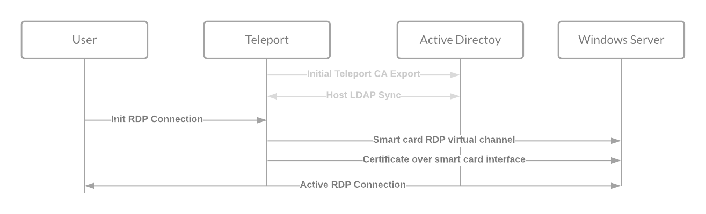
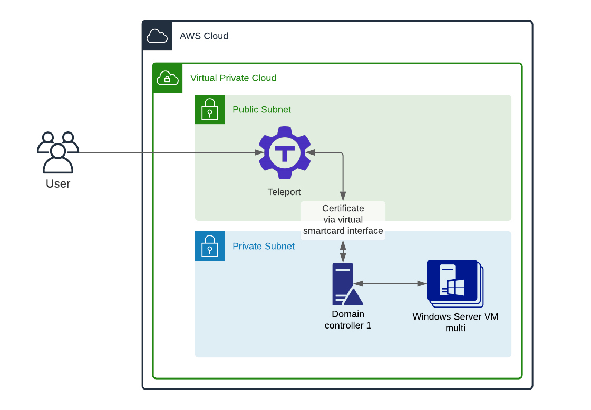

We are excited to [welcome Windows hosts to the Teleport Access Plane](/blog/rdp-access-for-windows-browser/). For the past 5 years we’ve helped refine our Access Plane for Linux hosts, providing short-lived certificate-based access, RBAC and developer-friendly access to resources. As we’ve rolled Teleport to larger organizations, we found that people wanted the same convenience and security of Teleport but for Windows hosts.

## How do you control access to Windows hosts?

Windows has historically been configured and administered using graphical user interfaces. Remote Desktop Protocol (RDP) is a proprietary protocol developed by Microsoft to provide GUI access to Windows Desktop and Servers over a network connection. You connect via an RDP client by providing a Host Name or IP address and login using a Windows user account username and password.

As organizations grow their Microsoft fleet, they must eventually build out a centralized way to manage, maintain and access these fleets. In the world of Windows, this will mean deploying Active Directory (AD) services using [domain controllers](https://social.technet.microsoft.com/wiki/contents/articles/52587.active-directory-design-considerations-and-best-practices.aspx#Domain_Controller_Deployment_and_Management) (DCs). AD responds to authentication requests and verifies users on the network. Since Active Directory has such privilege in the network, making Active Directory common targets for cyber attacks. If an adversary gets admin access to Active Directory, it’s often game over. This is why many opt to use a managed Active Directory service. If you do manage AD yourself, it’s important to follow best practices for hardening and network isolation.

An [RDP Gateway](https://docs.microsoft.com/en-us/windows-server/remote/remote-desktop-services/rds-plan-access-from-anywhere) might be deployed to provide access to internal network resources from outside the corporate firewall. This helps solve remote access problems…but there are a few other problems.

## “Hackers don’t break in, they log in.”

Weak passwords are the entry point for the majority of attacks across enterprise and consumer accounts. Microsoft has been working hard to move to a [passwordless future](https://techcommunity.microsoft.com/t5/azure-active-directory-identity/introducing-password-removal-for-microsoft-accounts/ba-p/2747280). Since its inception [Teleport has been passwordless](/blog/no-passwords/) and has never supported password-based SSH authentication. Teleport supports only [SSH Certificates](/blog/ssh-certificates/) for Linux servers and x.509 certificates for other protocols like databases and Kubernetes clusters since we wanted to keep passwordless access as our security invariant. With Teleport Desktop Access, we are bringing passwordless, certificated-based access to Windows as well.

But how do you login to Windows without a password?

If you watch the gif below, you’ll notice a server is selected. The login page appears, but the password field remains empty.

<video autoPlay loop muted playsinline>
  <source src="./assets/teleport-desktop-access.mp4" type="video/mp4" />
  <source src="./assets/teleport-desktop-access.webm" type="video/webm" />
  Your browser does not support the video tag.
</video>

## What is this magic — how does passwordless Windows authentication work?

With Teleport Desktop Access, to access a Windows host, instead of presenting a password, Teleport uses certificate-based authentication by emulating smart cards. [Smart Cards](https://docs.microsoft.com/en-us/windows/security/identity-protection/smart-cards/smart-card-windows-smart-card-technical-reference) are tamper resistant portable storage devices, providing security-critical computation for authentication and key exchanges. Smart cards are similar to HSMs or U2F/WebAuthn tokens - they store private keys and expose certificates and basic asymmetric crypto operations. Teleport presents a x.509 certificate on each connection attempt over the virtual smart card interface, and deliberately sets a time to live (TTL) of 5 minutes, which gives just enough time to establish a connection but not enough time that the cert would be useful if compromised. The virtual smartcard is presented to Active Directory Domain Controllers and requires trusting the Teleport Certificate Authority (CA) and allowing inbound connections from the Teleport Desktop Access service.



Once logged in, the Desktop Session can last as long as Teleport is configured to allow. Teleport also enforces a maximum idle session timeout, actively looking for user input in order to keep a session alive.

### Desktop Access Architecture

To better understand the deployment model, we’ve created this architecture diagram outlining the setup used while beta testing Desktop Access. Desktop Access requires additional configuration in Active Directory. I modified [Amazon’s Active Directory Domain Services on the AWS Cloud template](https://aws-quickstart.github.io/quickstart-microsoft-activedirectory/). This template provides best practices for network and machine hardening.

With Teleport Desktop Access gateway mode, a single Teleport process can serve as a gateway for connecting to multiple remote Windows hosts, similar to [Kubernetes Access](/kubernetes-access/). Hosts can be auto-discovered using the LDAP directory, or can be limited to a list provided in the Teleport configuration file.



### Desktop Access - role-based access control

Teleport has a very powerful Role-Based Access Control (RBAC) system. It provides fine- grained access and mapping of external groups. In the demo video, I show how a user is able to login as Administrator. Labels can be applied to hosts using a match on the Active Directory attributes. Below, the ‘dev’ label has been added to all staging nodes. This can be combined with Teleport RBAC to limit who can access which hosts.

```
host_labels:
  - match: '^.*\.dev\.example\.com$'
    labels:
      environment: dev
  - match: '^.*\.prod\.example\.com$'
    labels:
      environment: prod
```

### Who should try Teleport Desktop Access?

During early access, we’ve had a great cohort of beta testers. Teleport Desktop Access is ideal for teams who want to modernize their Windows access to match what they are doing with Linux, Kubernetes, Databases and internal applications like CI/CD or version control. Teleport Desktop access is a great fit for large Active Directory footprints where the team has full access to configure Active Directory.

Desktop Access does require hosts to be enrolled in Active Directory, so it’s not an ideal solution for home users looking to get access to their workstations.

If you would like to Try Desktop Access, I would recommend starting with our [Getting Started Guide](/docs/desktop-access/introduction/).

### What’s coming next?

As Teleport is an open-core company, you can always keep track of bug fixes and improvements by tracking the `desktop-access` label in GitHub. We’ll soon be adding Clipboard support and working to bring the rest of your favorite Teleport features to Desktop Access: including session recording and per-session MFA.