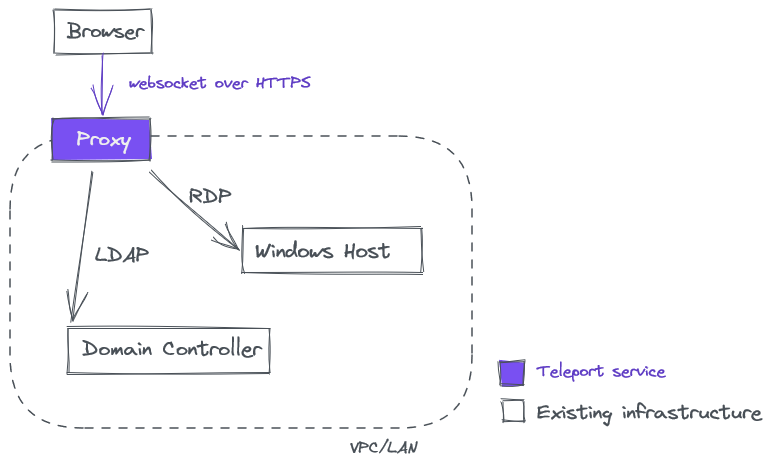

import { EmailSubscribeViolet } from "components/EmailSubscribe";
import Video from "components/Video";

If your organization runs cloud-native workloads on a mixed infrastructure of Linux and Windows, this announcement of Teleport 8 is for you!

TL;DR Teleport 8 enables easy and secure remote access to a mixed fleet of Linux/SSH and Windows/RDP hosts via a single TCP/IP port.

Before we dive deeper into how it works, let’s introduce Teleport to new readers of this blog.

## What is Teleport?

Teleport is an open source, identity-aware, multi-protocol access proxy with an integrated certificate authority. We call this concept the Access Plane. Teleport provides easy access to the following types of resources:

- Linux [servers](/ssh-server-access/) via SSH
- [Kubernetes](/kubernetes-access/) API, and other HTTPs endpoints behind NAT/firewalls.
- MySQL, PostgreSQL, MongoDB and other [databases](/database-access/).
- Private, internal [applications](/application-access/) like AWS Management Console, Jenkins, GitLab, Grafana or Kibana Dashboards, Jupyter Notebooks and more.

Consolidating network connectivity, access controls, policy enforcement, interactive session recordings and audit across all kinds of cloud resources in one place is the big idea behind the Access Plane concept. Teleport is used in production at NASDAQ, Google, Square, Snowflake, Epic Games, and other leading companies.

The Teleport version 8 we’re announcing today adds Windows support via a new Desktop Access product, and we’ll be adding support for new protocols and resource types.

## Desktop Access for Windows

The first version of Teleport, released in 2016, only supported the SSH protocol. While it was backward-compatible with the venerable OpenSSH implementation, it brought much-needed usability and security innovations on top of it, including:

- Identity-based authentication based on certificates, making them easy to use with single sign-on providers
- Per-session MFA with YubiKeys and other forms of MFA
- Interactive session recordings and the audit log unified for the entire server fleet
- Support for RBAC on top of SSH, with just-in-time temporary privilege elevation via access requests
- Cross-platform web GUI

All of these improvements over bare-bones SSH made Teleport a popular choice for remotely accessing cloud infrastructure for smart and quickly growing companies in [financial services](/use-cases/finance/), [SaaS](/use-cases/saas/), and [e-commerce](/use-cases/ecommerce-entertainment/) industries.

However, we kept getting requests to bring these innovations to the world of databases, Kubernetes, and also for Windows.

It turns out, most organizations today run workloads on a mixed-platform infrastructure, and synchronizing access across Linux and Windows fleets makes sense from both security and productivity perspectives. Nobody wants to login twice into two different operating systems, and there’s a need to make sure that access policies such as “developers cannot touch production data” can be easily enforced across both platforms.

Today we’re happy to announce the availability of Teleport Desktop Access. It extends the Teleport Access Plane offering, making it easy to secure access to both Linux and Windows hosts with a single passwordless login backed by strong cryptographic authentication. Teleport Desktop Access requires the RDP protocol to be enabled on machines with Windows Server 2012 R2, Windows 10 or newer.

## How does Desktop Access work?

Teleport Desktop Access is a combination of two services: the identity-aware proxy, and the certificate authority (CA) which also maintains the unified audit for your entire infrastructure. Both services are provided by a single downloadable binary executable or as a hosted cloud service.

Users authenticate against an Active Directory and use the web browser as a client. The reliance on web technologies not only allows the client to run on any platform, but also enables the session management to be unified with all other protocols supported by Teleport.

## RDP in a browser?

No. It is worth pointing out that Teleport Desktop Access does not use RDP and the Teleport Proxy does not expose the RDP protocol to clients. Instead, it uses standard Web protocols (websockets) over HTTPS, making it possible to access your entire Windows fleet via a single 443 port. The entire chain of trust is based on certificates issued by the Teleport Certificate Authority.

Here’s how the architecture looks like:

In the future we are planning to implement the optional “agent mode”, by deploying a `teleport_windows_service` sidecar directly onto target hosts. This will allow you to never expose RDP outside localhost, which is desirable by some customers who seek to simplify the exposed protocol stack.

You can read more about this implementation of Desktop Access in [RFD 34](https://github.com/gravitational/teleport/blob/master/rfd/0034-desktop-access-windows.md) and [RFD 35](https://github.com/gravitational/teleport/blob/master/rfd/0035-desktop-access-windows-authn.md). You will learn, for example, that Teleport provides a completely passwordless login experience via the virtual smartcard protocol on a Windows machine.

## Desktop Access demo

To see how Desktop Access works in Teleport 8.0 to access Windows hosts, check out the 1-minute demo video.

<Video videoId={"n2h0GisWdss"} mt={5} />

## Temporary limitations

We are believers in launching something useful as soon as possible and iterating quickly. The first release of Desktop Access comes with a few temporary limitations:

- It is not yet compatible with Teleport’s HSM integration.
- It does not support clipboard sharing.
- It does not support session recording.
- It does not support per-session MFA.

This list shouldn’t deter you from evaluating Desktop Access as we plan to quickly address these in the subsequent releases within months. You can always see our progress on [GitHub](https://github.com/gravitational/teleport/), or ask questions in our Slack.

## One port to rule them all

Another exciting feature of Teleport 8 is the ability to proxy all supported protocols via a single TCP/IP port. With all prior versions, setting up the Teleport Proxy meant configuring network rules for several ports: for SSH, for HTTP, for MySQL, Postgres, etc. Adding additional protocols, including the Desktop Access or additional databases, meant configuring more network ports.

Instead, Teleport 8 introduces the new concept which we call “TLS routing” which is based on two mechanisms:

- SNI (server name indication) routing, is another TLS extension that allows the client to indicate the destination by its domain name during the TLS handshake.
- Application-Layer Protocol Negotiation (ALPN) is a TLS extension that allows the application layer to negotiate which protocol should be performed over a TLS connection.

The end result is a much smaller attack surface area, and the reduced operational overhead of opening and configuring several network ports. Your entire computing infrastructure can be secured and easily accessible via a single network port! You can read more about this feature in our [RFD 39](https://github.com/gravitational/teleport/blob/master/rfd/0039-sni-alpn-teleport-proxy-routing.md).

<EmailSubscribeViolet />

## Try it yourself

Teleport is an open source project, and it is being developed in the open. The [full changelog](/docs/changelog/) of all Teleport releases can be found here, and the list of all 8.0 features and improvements can be seen in this [GitHub milestone](https://github.com/gravitational/teleport/milestone/59?closed=1).

Here’s the best way to try the latest release:

- [Download Teleport 8](/pricing/)
- Check out the [documentation](/docs/)
- Join the [Slack channel](/slack/) where Teleport users and developers hang out. User experience is very important to us, so let us know where we can get better!