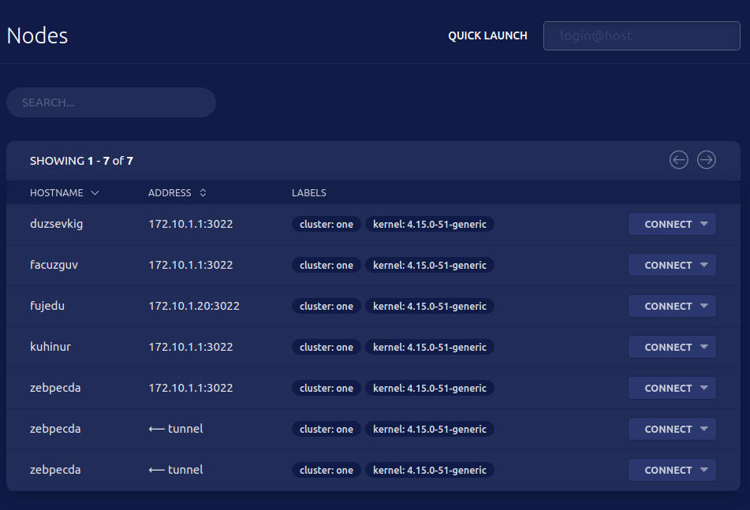

import { EmailSubscribeViolet } from "components/EmailSubscribe";

_This blog post has been updated as of 03/30/2021._

## Introduction

In this blog post we’ll cover how to set up an SSH jump server. We’ll cover two open source projects.

1. A traditional SSH jump server using [OpenSSH](https://en.wikipedia.org/wiki/OpenSSH). The advantage of this method is that your servers
   already have OpenSSH pre-installed. 2. A modern approach using [Teleport](<https://en.wikipedia.org/wiki/Teleport_(open-source_software)>),
   a newer open source alternative to OpenSSH.

Both of these servers are easy to install and configure, are free and open-source, and are single-binary Linux daemons.

## What is an SSH Jump Server?

An SSH jump server is a regular Linux server, accessible from the Internet, which is used as a gateway to access other Linux machines on a
private network using the SSH protocol. Sometimes an SSH jump server is also called a “jump host” or a [“bastion
host”](https://goteleport.com/blog/ssh-bastion-host/). The purpose of an SSH jump server is to be the only gateway for access to your
infrastructure reducing the size of any potential attack surface. Having a dedicated SSH access point also makes it easier to have an
aggregated audit log of all SSH connections.

Why not call it an SSH _proxy_? Partly due to historical reasons. In the earlier days of SSH, users had to SSH into a jump host and from
there, they had to type `ssh` again to “jump” to a destination host. Today, this is done automatically using the `ProxyJump` option.

## How to Set Up an SSH Jump Server

A good security practice is to have a dedicated SSH jump server, i.e. not host any other publicly accessible software on it. Additionally,
it is bad practice to allow users to log into a jump server directly. There are a few reasons why:

- Inadvertently updating the jump server configuration. - Using the jump server machine for other tasks. - Making copies of keys used to
  access destination servers.

It is also a good idea to change the default TCP port on the SSH jump server from 22 to something else.

Let’s go over configuring an SSH jump server using two open-source projects. We’ll start with OpenSSH as it’s the most common.

But first, let’s make a few naming assumptions for the examples used below:

- The example organization domain is `example.com` - The DNS name of the jump server is going to be `proxy.example.com`

We’ll also assume that `proxy.example.com` is the only machine accessible from the Internet.

## OpenSSH

This SSH server comes bundled by default with most Linux distributions and there’s nearly 100% chance you already have it installed. If the
server is accessible via `proxy.example.com` then you can access other servers behind the same NAT boundary via `-J` command line flag, i.e.
on the client:

`$ ssh -J proxy.example.com 10.2.2.1`

In the example above, the jump server is used to access another host on an AWS VPC with an address of 10.2.2.1. So far, this looks pretty
easy.

To avoid typing `-J proxy.example.com` all the time, you can update your client’s [SSH
configuration](https://goteleport.com/blog/ssh-config/) in `~/.ssh/config` with the following:

```
Host 10.2.2.*
    ProxyJump proxy.example.com
```

Now, when a user types `ssh 10.2.2.1` their SSH client will not even try to resolve `10.2.2.1` locally, but instead will establish a
connection to `proxy.example.com` which will forward it to 10.2.2.1 within its VPC.

Next, we need to harden the server configuration a bit by disabling interactive SSH sessions on the jump server for regular users, but
leaving it turned on for the administrators. To do this, update the `sshd` configuration, usually in `/etc/ssh/sshd_config` with the
following:

```
# Do not let SSH clients do anything except be forwarded to the destination:
PermitTTY no
X11Forwarding no
PermitTunnel no
GatewayPorts no
ForceCommand /sbin/nologin
```

The example above will work for Debian and its derivatives, we advise to verify the existence of `/sbin/nologin`.

This will work for as long as the jump server has accounts for all SSH users, which is inconvenient. Instead, consider creating a separate
user account on the jump server dedicated to “jumping users”. Let’s call it `jumpuser` and update the configuration:

```
Match User jumpuser
  PermitTTY no
  X11Forwarding no
  PermitTunnel no
  GatewayPorts no
  ForceCommand /usr/sbin/nologin
```

And the users will have to update their client SSH configuration with:

```
Host 10.2.2.*
    ProxyJump jumpuser@proxy.example.com
```

For more information on how to fine-tune SSH jump configuration to your particular situation, consult `man ssh_config` and `man sshd_config`.

Needless to say, the setup above works only when the public [SSH keys](https://goteleport.com/blog/comparing-ssh-keys/) are properly distributed not only between clients and the jump server, but also between the clients and the destination servers.

## Teleport

Teleport is a much newer SSH server, which was released in 2016. Unlike OpenSSH, Teleport is a highly opinionated SSH implementation:

- It insists on using an SSH proxy by default, and its SSH proxy has a web-based interface, allowing users to SSH using a browser.
- Unlike traditional SSH servers, Teleport removes the need to maintain “inventories” of servers as it offers a live introspection, i.e. you can list all online servers behind a proxy as shown in this screenshot:



In addition to having a modern proxy functionality, Teleport offers a few advantages over traditional SSH:

- It does not use SSH keys and instead defaults to more secure and flexible [SSH certificates](https://goteleport.com/blog/ssh-certificates/). This removes the need for key management and makes SSH servers completely stateless and configuration-free.
- It supports other protocols in addition to SSH, so the same “jump host” can be used to access other resources behind NAT, such as Kubernetes clusters or even internal applications via HTTP(s).
- Teleport does not rely on Linux users for authentication. Instead, it maintains a separate database of users or can integrate with a single sign-on with other identity providers such as Github, Google Apps, or enterprise options such as Okta and Active Directory.

Teleport always comes with a proxy (i.e. the same thing as a “jump server”) and there are no special instructions for setting it up. We
suggest you start by [downloading Teleport](https://goteleport.com/teleport/download/) for your platform and follow the [quick start
guide](https://goteleport.com/docs/getting-started/).

<EmailSubscribeViolet />

## Conclusion

In this blog post we covered how to set up an SSH jump server using two open-source projects: OpenSSH and Teleport. Which one should you
choose?

Use OpenSSH if:

- The number of servers or/and users in your organization is small
- You need a jump host setup quickly and do not have much time to learn new tech

Use Teleport if:

- Your server fleet or the size of your team is growing
- You need to connect to servers located “in the wild”, i.e. not restricted to a single VPC
- You have a couple of hours to play and learn a new tool
