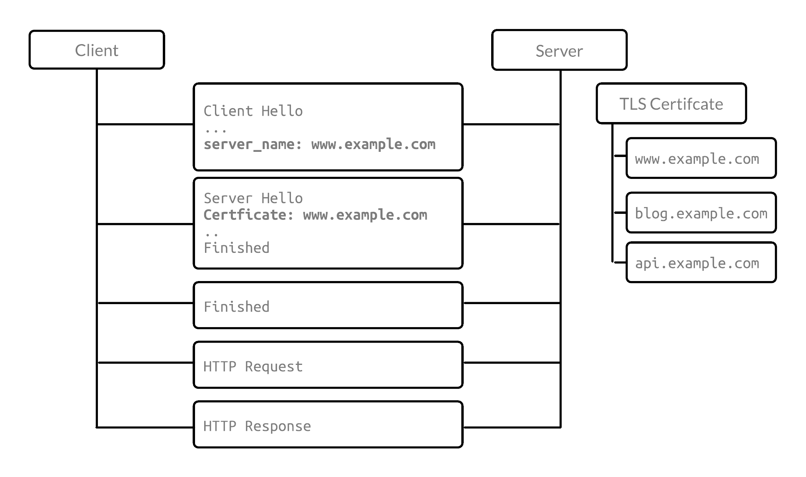
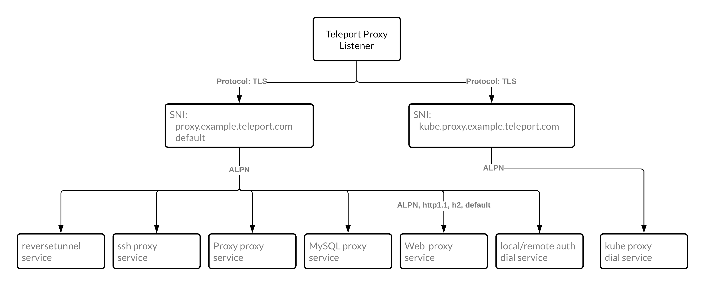

import BlogImage from "components/BlogImage";
import { EmailSubscribeViolet } from "components/EmailSubscribe";

As part of Teleport 8 we've made significant improvements to our routing, so much so the improvements have become a feature. Teleport 8 has new TLS routing that greatly reducing the port requirements needed for Teleport to run. Reducing the open network footprint down to a single port for your entire infrastructure and minimizing the attack surface. Want to know how we did it? Read on!

## What is SSL/TLS?

SSL is the OG cryptographic protocol developed by Netscape in 1995, whereas Transport Layer Security (TLS) was developed by the Internet Engineering Task Force (IETF) in 1999. By now all versions of SSL have been found vulnerable to attacks, and have been depreciated. Does this mean you need to throw out your SSL certificates and obtain TLS certifications? The answer is No, since both are x509 certificates — what really matters is the protocol that the server operates. These protocols are defined by the server configuration and not by the certificates. From now on in this blog, when referring to SSL/TLS we are referring to a secure protocol for providing encrypted communications between a web server and client (browser/cli/server) via HTTPS.

## Why are TLS extensions awesome?

TLS extensions were proposed a decade ago and provided a framework for extending the functionality of the TLS protocol. The original [RFC 6066](https://datatracker.ietf.org/doc/html/rfc6066) from January 2011 included Server Name Indication, Trusted CA Indication, Truncated HMAC and Certificate Status Requests. Extensions laid the groundwork for extending TLS beyond just Signature Algorithms; in short, laying the groundwork to make TLS useful to people using TLS.

## What is Server Name Indication (SNI)?

Server Name Indication (SNI) enables a client to specify the domain name it’s trying to reach in the first step of the TLS handshake, preventing common name mismatch errors.

SNI allows a server to safely host multiple TLS certificates for multiple sites under a single IP address. It does this by adding the hostname of the server during the initial TLS handshake. This is important as many companies use a shared IP, resulting in the ‘How do I get my server to select and present the correct certificate?’ question.

When SNI is used, the hostname of the server is included during the initial TLS handshake. When several servers are exposed in one port. The client sets that desired host in “Client Hello” SNI TLS extension during the initial handshake, and connection is routed to proper server.



## What is Application-Layer Protocol Negotiation (ALPN)?

Application-Layer Protocol Negotiation (ALPN) is a process in which the client sends the server a list of client-supported protocols in the ‘Client Hello’ message, letting the server negotiate the protocol based on server 's specified protocol list. This improves efficiency by reducing a round-trip. It lets the server know what protocol it would like to communicate in.

For example with HTTP2, ALPN can be used to reduce a round-trip since the connection doesn’t need to upgrade to HTTP2. Below is an initial example handshake message. Note that the Extension sends which protocol it’ll expect.

```
  Handshake Type: Server Hello (2)
    Length: 94
    Version: TLS 1.2 (0x0303)
    Random: 44e447964d7e8a7d3b404c4748423f02345241dcc9c7e332...
    Session ID Length: 32
    Session ID: 7667476d1d698d0a90caa1d9a449be814b89a0b52f470e2d...
    Cipher Suite: TLS_ECDHE_RSA_WITH_AES_128_GCM_SHA256 (0xc02f)
    Compression Method: null (0)
    Extensions Length: 22
    # [other extensions omitted]
    Extension: application_layer_protocol_negotiation (len=5)
        Type: application_layer_protocol_negotiation (16)
        Length: 5
        ALPN Extension Length: 3
        ALPN Protocol
            ALPN string length: 2
            ALPN Next Protocol: h2
```

## Why does Teleport have so many port requirements?

To understand Teleport port requirements, it’s important to understand how networks work. The simplest explanation is that ports are used to identify what process to connect to. For example, data on port 80 goes to the http process and data on port 25 will go to the mail process. There are 65,535 network protocols, with restricted and well-known ports reserved from 0 to 1023. These can include Port 22 for SSH, Port 25 for SMTP and Port 123 for NTP.

As people set up Teleport, they have to open up a wide range of ports to get Teleport to work. Teleport speaks a different protocol per service, requiring a new port open to correctly process that protocol. As we’ve added more services, it’s meant adding more ports to open up. While we incremented ports from 3026, we know that we needed to come up with a better solution.

Below is a list of Teleport’s current port requirements. For this post, we’re focusing on all ports used for the Teleport Proxy. To know more about how Teleport works, please check out our [Architecture Introduction](https://goteleport.com/docs/architecture/overview/).

<table>
  <thead>
    <tr>
      <th>Port</th>
      <th>Service</th>
      <th>Description</th>
    </tr>
  </thead>
  <tbody>
    <tr>
      <th>3022</th>
      <td class="no-wrap">Node</td>
      <td>SSH port. This is Teleport's equivalent of port `#22` for SSH.</td>
    </tr>
    <tr>
      <th>3023</th>
      <td>Proxy</td>
      <td>
        SSH port clients connect to. A proxy will forward this connection to
        port `3022` on the destination node.
      </td>
    </tr>
    <tr>
      <th>3024</th>
      <td>Proxy</td>
      <td>
        SSH port used to create "reverse SSH tunnels" from behind-firewall
        environments into a trusted proxy server.
      </td>
    </tr>
    <tr>
      <th>3025</th>
      <td>Auth</td>
      <td>
        SSH port used by the Auth Service to serve its API to other nodes in a
        cluster.
      </td>
    </tr>
    <tr>
      <th>3080</th>
      <td>Proxy</td>
      <td>
        HTTPS connection to authenticate `tsh` users and web users into the
        cluster. The same connection is used to serve a Web UI.
      </td>
    </tr>
    <tr>
      <th>3026</th>
      <td class="no-wrap">Kubernetes</td>
      <td>HTTPS Kubernetes proxy `proxy_service.kube_listen_addr`</td>
    </tr>
    <tr>
      <th>3027</th>
      <td class="no-wrap">Kubernetes</td>
      <td>Kubernetes Service `kubernetes_service.listen_addr`</td>
    </tr>
    <tr>
      <th>3036</th>
      <td>MySQL</td>
      <td>MySQL port `proxy_service.mysql_addr`</td>
    </tr>
  </tbody>
</table>

## Using SNI & ALPN to reduce Teleport proxy port requirements

Putting it all together, Teleport has made use of the properties of SNI & ALPN extensions to reduce proxy port requirements down to one port. It achieves this by first using SNI to direct proxy or Kubernetes traffic, then uses ALPN to be able to know which service to route to.



If you would like to dive deeper into the decisions and pros and cons of SNI & ALPN Routing, please check out [RFD 39](https://github.com/gravitational/teleport/blob/master/rfd/0039-sni-alpn-teleport-proxy-routing.md).

## How do I use this feature?

TLS routing can be enabled by default in Teleport 8 by including the following auth service configuration. One this is set up you can reduce the amount of open ports on the Teleport Proxy. Reducing ports from 3023 - 3027, down to port 443.

```yaml
auth_service:
  proxy_listener_mode: multiplex
  ...
```

Once routing has been updated, setting Teleport configuration version to v2 to prevent legacy listeners from being created:

```yaml
version: v2
teleport:
---
proxy_service: ...
```

<EmailSubscribeViolet />

After you’ve enabled TLS routing, the workflow should be the same as long as users upgrade to tsh 8. There is an interesting edge case for Teleport Database Access as most database clients such as `psql` or `mysql` do not speak plain TLS and instead implement TLS handshake as a part of their protocol-specific connection negotiation phase (aka [STARTTLS](https://en.wikipedia.org/wiki/Opportunistic_TLS)).

To support these clients, as well as clients that do speak TLS but don't allow setting custom ALPN values, Teleport's `tsh` client includes the ability to start a local TLS routing aware proxy.

Such clients connect to the local proxy instead of the Teleport proxy directly. The local proxy establishes a TLS connection to the Teleport proxy with the proper SNI/ALPN values set and tunnels the client's connection over it.

Setting SNI/ALPN values and local proxy tunneling happen transparently in most cases; for example, when using `tsh` client to connect. For some clients (for example, native/GUI database clients like `psql` or pgAdmin instead of `tsh db connect`), the local proxy needs to be running so these clients can connect to it.

If you enjoyed this blog post, and the unique way we’ve leveraged TLS extensions, we would love to know if you add something similar to your project. If these kinds of problems and solutions sound interesting to you, please consider [joining us at Teleport](https://goteleport.com/careers/).
