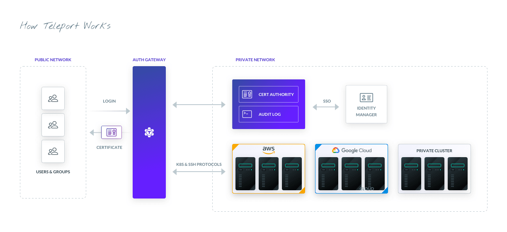

import { Quote, Feedback } from "components";

Auth0, founded in 2015, is an Identity as a Service (IDaaS) company designed with the mission to make the internet safer. The company’s universal authentication and authorization platform makes it easy for their customers to add authentication and authorization services for web, mobile, and legacy applications.

Because many of their customers need to meet PCI compliance, Auth0 needed an access and security solution that would provide their customers with the peace of mind that their environments were completely isolated. Teleport served Auth0’s purpose as it met their security, compliance, and flexible authentication needs.

<Quote title="About Auth0">
  Today, Auth0 is about 500 employees strong and manages over 2.5 billion logins per month. The company offers both public and private hosted editions of its flagship product. Auth0 was built around developers and makes it dead simple to add authentication with just a couple of lines of code. In the multi-tenant service, data is isolated and encrypted, but nonetheless, many customers opt to use the private cloud instance on dedicated environments, typically for compliance reasons.
</Quote>

## The 3 main challenges
Auth0 needed a solution that would do 3 main things:

1. Create an offering for security-conscious customers that wanted control of their data
2. Serve as a single solution that would work for both their multi-tenant and single-tenant customers
3. Enable their customers to achieve PCI and security compliance requirements

Because Auth0 deals with so many security-minded customers, they needed a solution that was simple to use, easy to navigate, and most importantly, secure.

## Finding the right solution - RBAC, compliance, and flexible authentication
Auth0 initially came across the Teleport open source community edition. Because it is open source and supported OIDC, one of the first things they did was add support for Auth0 directly into Teleport; in other words, they authenticate into Teleport using Auth0.

Having this flexible authentication solution was key for Auth0, but they also needed to prioritize security.
<Figure
  caption="Figure 1: How Teleport Works"
  imagePositioning="center"
>
    
</Figure>

Teleport provides a secure SSH gateway that gives users the ability to grant temporary access to infrastructure. Auth0 uses Teleport’s secure SSH gateway, along with built-in role-based access control (RBAC) which automatically terminates sessions after a pre-defined period of time, to securely access their customers’ infrastructure to provide support and maintenance.

Auth0 also uses RBAC to ensure only the right support staff from the right teams are accessing the right customer infrastructure as needed. Just as importantly, the only connection to the outside for customer infrastructure is provided by Teleport. This ensures that Auth0’s support teams can provide troubleshooting when needed and not have to manage any SSH keys.

Teleport also helps Auth0 meet security and compliance requirements. Teleport not only stores logs of every session, but records sessions for playback so users can see exactly what was done in each session. Auth0 and their customers appreciate the recordings; they are able to see why something isn’t in the state it is supposed to be.

In addition to the multi-tenant edition of Auth0, the team currently manages nearly 70 private instances for customers, each with at least 3 environments and up to 12 servers, and each node is accessed through Teleport. According to Pablo Terradillos, Engineering Manager at Auth0: “Teleport provided a secure, transparent and easy way for Auth0 to access our customer environments and achieve SSH Requirements and PCI Compliance. It helped our Managed Services Engineering Team to provide support 24x7 to our customers worldwide. We went from about 20 environments to over 120 in less than a year.”
<Feedback reviews={meta.reviews} />
