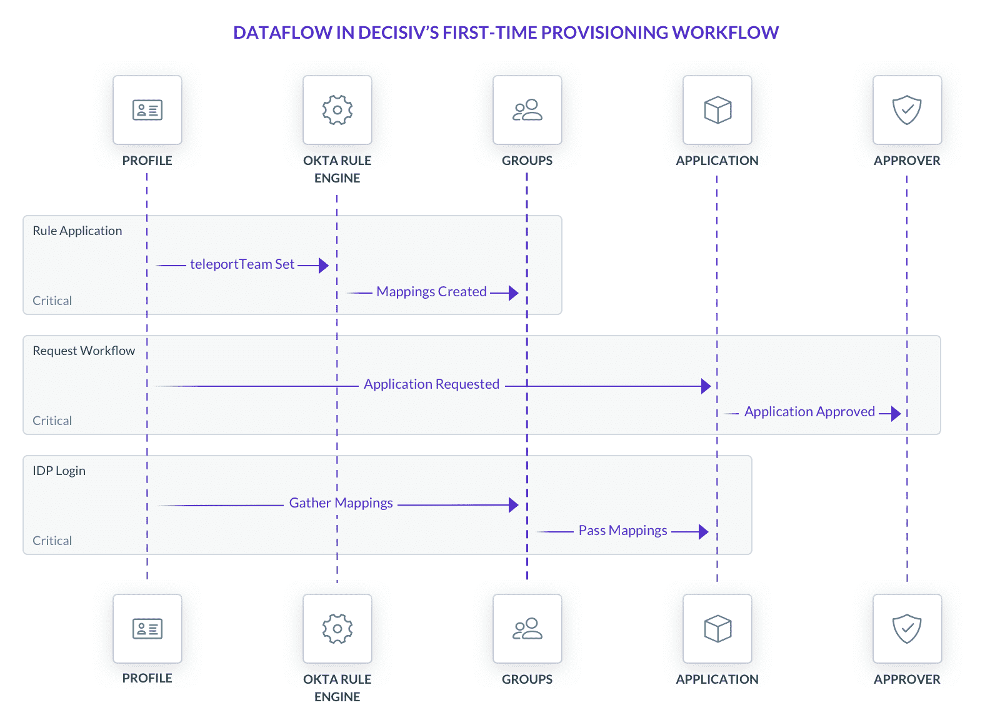
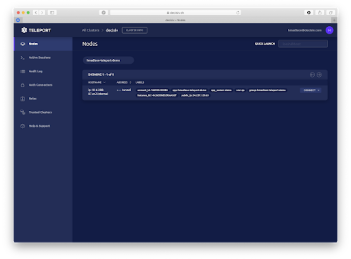

import Feedback from "components/Feedback";
import Quote from "components/Quote";
import VideoBanner from "components/VideoBanner";

Decisiv is a growing company that manages records of commercial assets, such as trucks. This case study looks at the impact to the engineering, DevOps, and infrastructure teams at Decisiv as the organization experienced rapid growth and decided to “lift and shift “ core compute resources to a commercial cloud vendor. The team chose Teleport as a secure, simple-to-use, and transparent security and access solution that has resulted in a more robust, agile (faster onboarding and offboarding), and compliant environment.

<Quote title="About Decisiv">
  Founded in 2001 in Virginia, Decisiv is revolutionizing service event
  management for high value, complex commercial assets and vehicles. Its Service
  Relationship Management (SRM) platform uniquely connects the right information
  to the right people and at the right time. This increases asset uptime,
  reduces total cost of ownership (TCO), and improves the quality of life for
  commercial asset owners and operators as well as their teams. Decisiv’s PaaS
  SRM architecture is the first fully integrated, end-to-end service event
  management solution for commercial assets to fully leverage the Industrial
  Internet of Things (IIoT). It connects service supply chain members and
  in-context information to enable real-time communication and collaboration. It
  also puts controls in place to ensure service event management consistency.
</Quote>

## Challenges

- Cost effectively deal with increased complexity of managing a rapidly growing distributed engineering workforce
- Manage and maintain security in an ever increasing virtual environment while transitioning from on-premise to AWS and adopting a cloud-native approach.
- Meet customer demands for auditable access that is easy to use, easy to configure, and a system that did not get in the way of the engineers

### Dealing with Engineering Growth

Decisiv’s business is experiencing growth as the number of commercial assets records and the complexity of managing them increases. As the business expands, so does the size of the engineering team and the number of servers it needs to handle the new workload. This growth increases the complexity of managing access to multiple systems from multiple engineers in multiple locations.

<Feedback reviews={meta.reviews1} />
Decisiv needed a security setup that could handle the growth of the company. The
solution needed to handle a large number of onboarding and offboarding events across
geographies and be able to implement a robust role-based access control (RBAC) system
that ensured that only authorized users could access authorized resources.

### Moving to the Cloud (Lift and Shift)

Decisiv’s strategy also included a movement of computer infrastructure from in-house to a commercial cloud vendor and adopting a more flexible cloud native approach. This introduced new challenges such as changing infrastructure, more virtual servers, and more containers. Such obstacles created a burden on how to manage and maintain security in an ever increasing virtual environment. At the same time, they gave developers and engineers the flexibility to get their jobs done.

Decisiv’s team knew that their existing solution of managing all of the SSH keys using their provision management process was too slow - getting a new team member set up and able to access the system would take six to 12 hours because the keys needed to be distributed. What Decisiv needed was an access solution that would serve its needs as a global remote company with a heavy emphasis on having dynamic servers and many cloud servers for isolation. What they needed was security that wouldn’t get in the way or be viewed as an impediment by developers.

### Auditability and Compliance

Decisiv had massive multinational clients who required that Decisiv prove that they could secure, audit, and control access to data and information. The company had to transition from simple, basic patterns of access control to a more “auditor-friendly” process. Decisiv needed a solution that could provide compliance to ISO 27002, ISO 9,000, PCI DSS, FedRAMP, NIST 500-292, GDPR and CCPA. Any compliance solution provides an audit log on who did what and when. But more importantly, Decisiv needed a solution that was easy to use, easy to configure, and a system that did not get in the way of the engineers.

## The Solution

### Standardize on Teleport

To solve the challenge of providing secure access to developers and dealing with compliance hurdles, Decisiv deployed Teleport Enterprise, the commercial product built around the open source project, Teleport. Teleport is a gateway for managing access to clusters of servers via SSH or the Kubernetes API and is intended to be a drop-in replacement for OpenSSH.

Teleport Enterprise enabled Decisiv to quickly solve the pain of scaling the engineering team, migrating to the cloud, and maintaining compliance.

<Feedback reviews={meta.reviews2} />

### Decisiv’s Five Step Integration Process

#### Step 1. Configure Teleport as the identity provider

Decisiv set up Teleport to accommodate their massive backend SAML IDP. Teleport provides:

- a highly available cluster of authentication proxy servers, which create an auditable and IDP-secured SSH bastion host.
- an X.509 Certificate Authority - every time a user logs in, a newly refreshed x509 certificate is generated. Client certificates can be used to authenticate with tools that don’t necessarily support single sign on (SSO) out of the box.
- the ability to store state locally. In Decisiv’s use case, Teleport stores its state locally in AWS S3 and DynamoDB.
- transparent recording of end user actions into multiple auditable formats.

#### Step 2. Create a simple provisioning workflow

<Figure caption="Figure 1: Teleport Workflow" imagePositioning="center">
  
</Figure>

As shown in the chart above, when a person joins Decisiv:

- HR will set their Teleport team, which will create group mappings behind the scenes to give them roles.
- Then, they can go through the OKTA request workflow, which gives the person access to the Teleport application.
- From there, the Teleport team role mapping and request workflow come together and pass the needed data to Teleport, which gives the person the auditable SSH access they need.

#### Step 3. Use role based access control (RBAC)

Decisiv’s solution took advantage of Teleport’s labeling system. Teleport labels can be used when evaluating roles to give people access. Decisiv had a single role for all developers and interpolated its developer team with those labels.

<Figure caption="Figure 2: Role Based Access" imagePositioning="center">
  
</Figure>

#### Step 4. Unleash the engineering team

Decisiv found that getting engineers to adopt Teleport as an SSH Server was easy and simple. Engineers `ssh` just like before because under the hood, Teleport is literally just an SSH server. Tools that use SSH and can read `~/.ssh/ssh_config` (such as Ansible Inspec, Capistrano, OpenSSH and Windows) will work with Teleport. There was no learning curve.

#### Step 5. View the session recordings

Teleport automatically records every session by default. The Enhanced Session Recording feature made Teleport even more proactive, searchable, and easy to audit from the tool or from Decisiv’s SIEM solutions.

## Technical Architecture

<Feedback reviews={meta.reviews3} />
<Figure
  caption="Figure 3: Teleport deployment at Decisiv"
  imagePositioning="center"
>
  
</Figure>
Decisiv implemented its solution in terms of tiers:

- <b>“User” Tier</b> – This tier helped Decisiv, as a global remote company, understand
  where its users were and where its nodes were.
- <b>Cluster Mode</b> – Cluster Mode was set up based on user requirements. For example,
  in the tunneled cluster mode, one would run a single cluster. In a trusted cluster
  mode, each account got its own Teleport cluster.
- <b>Load Balancing Tier</b> – Decisiv ran Teleport in a high availability (HA) setup
  and used application load balancers as well as network load balancers.
- <b>Application Tier</b> — Decisiv ran Teleport via an autoscaling group with one
  host per AZ. They stacked the Auth and Proxy components together onto the same
  host and use Amazon’s SSM for their “break glass” mechanism (to get direct access
  to the Teleport host for troubleshooting).
- <b>Database Tier</b> — Decisiv used S3 to store sessions and Dynamo to store state
  and events. This made its auth/proxy hosts stateless, which makes upgrades painless
  and opens up SIEM integrations.

### Results - Accelerated Secure Developer Access at Decisiv

Using Teleport has helped Decisiv solve common secure developer access problems such as developer onboarding (when new developers join) and offboarding (when developers leave). It has solved the problem of scaling access to a growing developer team while maintaining compliance. It has made the transition from on-premise to cloud infrastructure much easier to configure, manage and audit. Instead of waiting for days, engineers can be productive in hours and the Decisiv SecOps team can have the peace of mind knowing everything is being recorded ensuring that they meet exacting compliance requirements.

<Feedback reviews={meta.reviews4} />

## Watch the Webinar

<VideoBanner videoId={"qNKsG3z_qJU"} bg="flatWhite" />
