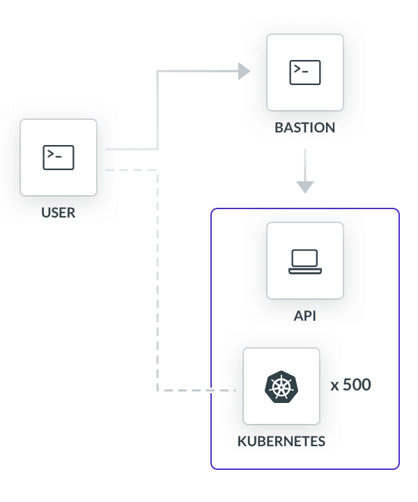
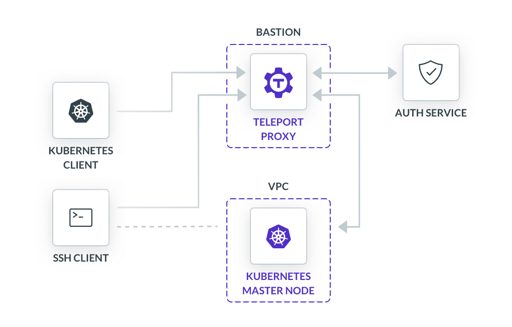

import { Box, Link, Flex, Feedback, Quote } from "components";

For ExtraHop, the bar for security is high. With their cloud-hosted network detection software, it has to be [security best practices](/resources/white-papers/secure-infrastructure-access/) or bust. So when developer shortcuts started becoming possible vulnerabilities, ExtraHop used Teleport to secure access to their servers and Kubernetes clusters without sacrificing speed. Within a couple months, they had an identity-based approach to authorizing each Kubernetes API query or ssh command — all the while making sure ExtraHop’s internal security team had the logs they needed for compliance and reference. With plenty of tweaks left to make, ExtraHop will continue using Teleport to sharpen up their and their customers’ security.

<Quote title="About ExtraHop">
  ExtraHop provides cloud-native network detection and response software to secure hybrid enterprises. Employing advanced technologies like machine learning to all network traffic provides hybrid and multi-cloud, real-time threat detection, and quick responses. ExtraHop’s appliances can be deployed on-prem or in public clouds like AWS and Azure.
</Quote>

## Meeting SLAs
To compete in cybersecurity, a good product and a good reputation are table stakes. ExtraHop has both, which they maintain by keeping customers happy with ironclad SLAs supported by Kubernetes orchestration on AWS. But as the company grew, what started as a convenient way for the infrastructure team to hop between nodes became a problem for them and their adjacent security team.

<table>
  <thead>
    <tr>
      <th>Team</th>
      <th>Problem</th>
    </tr>
  </thead>
  <tbody>
    <tr>
      <td>Infrastructure</td>
      <td>
        <ul>
          <li>Onboarding/offboarding employees</li>
          <li>Hard-coded and shared secrets</li>
        </ul>
      </td>
    </tr>
    <tr>
      <td>Security</td>
      <td>
        <ul>
          <li>Hard-coded and shared secrets</li>
          <li>Minimal visibility</li>
        </ul>
      </td>
    </tr>
  </tbody>
</table>

## Architecture Briefing
In order to meet customary SaaS SLAs like high availability and guaranteed uptime, nodes are dynamic, spinning up and down on an as-needed basis. ExtraHop’s competitive SaaS SLAs are more complicated. Dealing with sensitive customer data, nodes have to be single-tenant. Security products that share data storage are a non-starter. Stretching Kubernetes clusters even further, each short-lived session requires its own node — no reuse. Start, stop, delete.

Totaling the bill, ExtraHop had half a dozen Kubernetes clusters, each running hundreds of individual nodes, spinning up and down dozens of times a day. Maintaining the degree of security and flexibility required to deliver excellence, the infrastructure team took a hands-on approach, forgoing managed Kubernetes services to keep it all in-house.

The diagram below (Figure 1) shows a simplified visualization of ExtraHop’s architecture. Users on the infrastructure team (ie. admins) would route traffic through a [bastion host](/blog/how-to-ssh-properly/) into a VPC with a Kubernetes cluster inside. Any kube commands ran through the same flow, but when the team needed [needed shell access](/blog/ssh-vs-kubectl/), they could do so directly into nodes with a configured ssh-agent and a reverse tunnel.
<Figure
  caption="Figure 1: ExtraHop Cluster Architecture"
  imagePositioning="center"
>
  
</Figure>

## Speed or Security
In an ideal world, any secret used by the infrastructure team would be tightly bound to security procedures. Unfortunately, security and engineer productivity are often viewed as a zero-sum game; one constrains the other. Before Teleport, the ExtraHop infrastructure team consisted of a handful of people, keeping the risk of secrets mismanagement low while operating at a brisk pace.

These authentication methods let the infrastructure team move quickly between cloud environments that started and stopped all day. But as the company scaled, customers increased, and infrastructure grew, this approach became a liability:

### Build or Buy
ExtraHop found themselves in the middle of three related vectors. The network security company needs to offer competitive SLAs, which shaped its SaaS backend and exposed a security hole. To patch up vulnerabilities, the security and infrastructure team went back to the drawing board and considered options. They needed a way to keep pace with customers while keeping internal security locked down.

Being a security company themselves, they certainly had the resources to build this tool, but that raised its own set of challenges. It would require heavy upfront investments in time and money to create the security controls and logging mechanisms needed. And to remain vigilant with security best practices, the tool would have to evolve as the bar got raised. When considering where to spend resources, ExtraHop went directly to the [OSS version](/teleport/download) of Teleport and were buoyed by the presence of an [active community](https://github.com/gravitational/teleport/discussions) of users and devs working together to solve problems.
<Feedback reviews={meta.reviews} />

## Implementation
### A Single Proxy
Cloud [rejects](/resources/white-papers/environment-free-computing/) the operating model of its predecessor, client-server, but still carries its baggage. For the longest time, co-located engineers and machines put remote access protocols out of mind. But now, employees at home had to deal with thousands of ephemeral environments, each with their own special way of connecting over TCP/UDP. Unable to communicate with each other, they performed variants of the same authentication and authorization process in parallel.

With Teleport, ExtraHop routed all traffic through a proxy — a universal port of entry that accepted all forms of credentials. Each kubectl command and ssh connection request gets routed through a proxy service, hosted on their bastion server in front of a VPC. The proxy gates all requests, regardless of what the resource is — in this case, Kubernetes and servers, but can also include [databases](/docs/database-access/) and [web applications](/docs/application-access/). Placed between the client and machine, the Teleport proxy authenticates and authorizes each user in a manner that removes its dependency on the remote protocol in use.
<Figure
  caption="Figure 2: Teleport Proxy with SSH Reverse Tunnel"
  imagePositioning="center"
>
  
</Figure>

Figure 2 shows an updated diagram for ExtraHop’s architecture. In it, the Teleport proxy authenticates the admin through a single service for Kubernetes and SSH. Because access is channeled through a central point, Teleport is able to enforce global authorization. Taking information gleaned during authentication, the proxy runs through an admin policy specified in a separate authorization service. If conditions are met, the Teleport proxy will grant role-based access. In the case of ssh, it also creates a reverse tunnel between the client and node, bypassing the Teleport proxy service, after initial authentication and authorization. All of this is accomplished with minimal additional configuration; in fact it’s just a [single YAML file](/teleport/docs/config-reference/).

```
  # Teleport.yaml
  auth_service:
    enabled: yes
    # IP and the port to bind to
    listen_addr: 0.0.0.0:3025
    # Optional DNS name
    public_addr: auth.extrahop.com:3025
  ***snipped***
  # configures ssh service for each node
  ssh_service:
    enabled: yes
    listen_addr: 0.0.0.0:3022
  ***snipped***
  proxy_service:
    enabled: yes
    # SSH forwarding/proxy address
    listen_addr: 0.0.0.0:3023
    # DNS for ssh endpoint
    ssh_public_addr: proxy.extrahop.com:3023
    # This section configures the Kubernetes proxy service
    kubernetes:
      enabled: yes
      listen_addr: 0.0.0.0:3026
      public_addr: ['kube.extrahop.com:3026']
      # Path to Kubernetes credentials
      kubeconfig_file: /path/to/kube/config
```

## Certificates
Juggling secrets across the cloud is a far cry from glamorous. They embody the core logic behind the speed or security dichotomy. Consider a process optimized for security: Each admin has a unique credential for every cluster API and group of nodes. Credentials would be centrally stored, encrypted, and rotated on a regular basis. In the cloud, where infrastructure is fragmented, sorting a never-ending pile of secrets does not merit the effort. With burdensome operation overhead looming, it’s no wonder the infrastructure team created shortcuts — it’s easier.

Worst yet, credentials are one-dimensional. Passwords have a few bits of entropy, SSH keys have many more, and bearer authentication is a password wrapped in a token. For ExtraHop, sharing a password file frees up mobility, but without additional information, user activity becomes homogenized, obfuscated and impossible to track.

To adapt, ExtraHop switched to certificates for authentication. With certificates as credentials, ExtraHop could gather additional information from the client, a boon for both security and infrastructure teams. Compared to the other options, certificates have fields for additional data to customize access policies.

For ExtraHop, User Identity and TTL were particularly important. Connection could be mapped to a particular user and would expire, minimizing the problem of persistent secrets. For the security team, the improvements were obvious. Rotating credentials made unauthorized access a moving target, and identity added color to past events. Capturing identity information was superficial, requiring minimal setup. Certificates are generated after a user authenticates with their SSO provider, which in this case is Okta. The Teleport auth server receives SAML assertions about the user from Okta and enriches certificates before issuance. Employees could carry on their business, leaving behind dinosaur-size footprints for anyone watching.
<Figure
  caption="Figure 3: Teleport auth service collecting data SAML assertions after user authentication through SSO portal"
  imagePositioning="center"
>
  
</Figure>

For the infrastructure team, onboarding and offboarding became much simpler — no more downtime to update hundreds of nodes. As in the previous section, primary authentication and authorization gets routed through a single proxy with a detached auth service. In other words, before Teleport, trusted ssh connections happened at the agent within a Kubernetes node. Onboarding meant adding a new key to `./ssh/authorized_keys` in each node. With Teleport, the auth service issues new certificates that only the proxy needs to validate, all before Kubernetes is touched. Now, onboarding meant adding the new hire to Okta and having them SSO into a node or shell — it’s easy.

## Audit Logs
No company wants to be on the receiving end of a security breach. That’s partly what keeps network security companies in business, helping their customers cut down time spent on incident response and investigation. ExtraHop is no exception. To keep their status as a reputable security company, they needed records on-hand in case of their own break-glass scenarios. ExtraHop mirrored SSH and Kubernetes syslogs over AWS CloudWatch, but because secrets were shared, the logs collected were incapable of attributing actions to an admin.

By using certificates as primary credentials, audit logs now left a [high-resolution](/teleport/how-it-works/audit-logging-for-ssh-and-kubernetes/) trail of activity, crediting a person to each session. To the delight of their security and compliance teams, Teleport dumped entire recorded sessions into an S3 bucket. With both rich logging information and complete videos of every CLI command, obtaining compliance standards like HIPAA and FedRAMP was more in sight.

## Speed and Security
The nature of cybersecurity work relies on a certain degree of trust, both in product and company. Customers depend on guarantees of data availability and security. The repercussions of lapsing uptime or an unavailable node for ExtraHop far outweigh the minor inconveniences of a downed email server. So when the mechanisms that supported these SLAs threatened one of these two axioms of cloud-hosted network detection and response, ExtraHop used Teleport to correct course.

<table>
  <thead>
    <tr>
      <th>Team</th>
      <th>Problem</th>
      <th>Solution</th>
    </tr>
  </thead>
  <tbody>
    <tr>
      <td>Infrastructure</td>
      <td>
        <ul>
          <li>Onboarding/offboarding employees</li>
          <li>Hard-coded and shared secrets</li>
        </ul>
      </td>
      <td>
        <ul>
          <li>Short-lived certificates</li>
          <li>Session logs and recording</li>
        </ul>
      </td>
    </tr>
    <tr>
      <td>Security</td>
      <td>
        <ul>
          <li>Hard-coded and shared secrets</li>
          <li>Minimal visibility</li>
        </ul>
      </td>
      <td>
        <ul>
          <li>Identity-based auth</li>
          <li>Session logs and recording</li>
        </ul>
      </td>
    </tr>
  </tbody>
</table>

Cloud-based software presents a unique set of challenges for both security and infrastructure teams. Remote workers accessing ephemeral compute instances constitute an operational nightmare, leading to shortcuts, for better or worse. This is what lies at the heart of the speed and security dichotomy for cloud-native development. With Teleport, ExtraHop has achieved speed and security, giving them (and their customers) confidence in their products.
