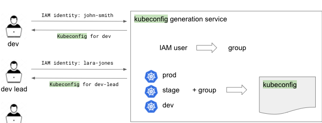
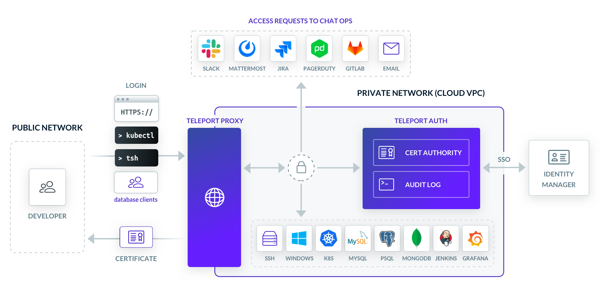
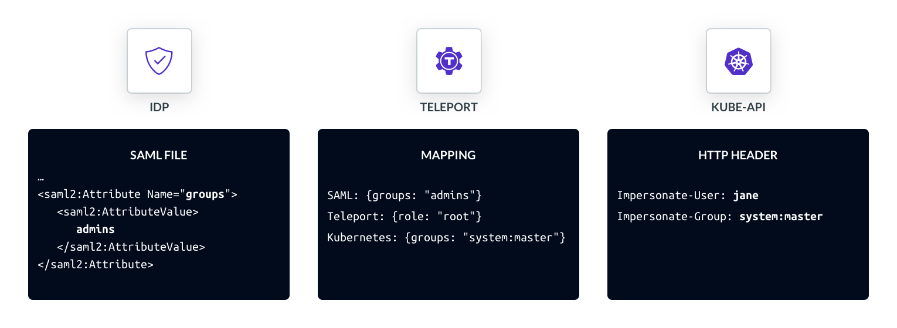

import Feedback from "components/Feedback";
import Quote from "components/Quote";
import SimpleBanner from "components/SimpleBanner";
import Section from "components/Section";

<Section bg="flatWhite">
  <SimpleBanner>
    <SimpleBanner.Item isBadge src="card" title="Tied access to identity">
      Identity attributes are interpreted by the Kubernetes API, letting developers keep one contiguous identity from OneLogin to infrastructure.  
    </SimpleBanner.Item>
    <SimpleBanner.Item isBadge src="shieldCheck" title="Met SOC 2 Compliance">
      In 2020, thredUP updated their security best practices for an upcoming SOC 2 certification. Detailed audit logging and RBAC let them pass well above the minimum requirements
    </SimpleBanner.Item>
    <SimpleBanner.Item isBadge src="clock" title="Freed up time">
      Using an in-house solution meant long setup times for developers and a dedicated employee for support. Teleport freed up resources with out-of-the-box setup.  
    </SimpleBanner.Item>
  </SimpleBanner>
</Section>

<Quote title="About" linkSrc="https://www.thredup.com" linkTextTitle="thredUp">
  thredUP is one of the world’s largest online resale platforms for women’s 
  and kids’ apparel, shoes, and accessories. With a mission to inspire a new 
  generation to think secondhand first, the company has spent the past 10+ 
  years reinventing resale. By building a marketplace and infrastructure 
  now poised to power the $15 billion resale economy, thredUP is changing 
  the way consumers shop and ushering in a more sustainable future for the 
  fashion industry. Millions of consumers rely on thredUP as the easiest way 
  to sell their clothes and shop over 35,000 brands at up to 90% off estimated 
  retail price. Some of the world’s leading brands and retailers are also 
  leveraging thredUP’s Resale-as-a-Service to deliver customized, scalable 
  resale experiences to their customers.

  thredUP, founded just a year after AWS in 2009, has lived through the 
  transition to cloud, going from monolithic to microservices before it was 
  cool. In 2017, that migration included ditching handcrafted servers for 
  Kubernetes orchestration. One year later, thredUP was entirely on Kubernetes, 
  seeing massive reductions in costs and deployment times. To keep a close eye 
  on resources, the infrastructure team built an in-house solution to grant access 
  through the powerful Kubernetes RBAC API. As the company grew, the infrastructure 
  team found themselves dedicating more time and hours just to keep their tool 
  functional. That’s where Teleport came in.
</Quote>

## Building In-House

When thredUP deployed their services on Kubernetes, the default method 
to access development environments shifted from `ssh` to `kubectl`. While 
the built-in RBAC API was definitely an improvement, the infrastructure 
team needed a new way for engineers to access Kubernetes clusters. Wanting 
to keep with security best practices, they built an in-house service that 
kept them in control, programmatically creating client kubeconfigs from AWS IAM roles.

A user would access a Kubernetes cluster by following these steps:

1. Client generates a token with the user's AWS credentials. Requested cluster name and role are included.
2. Client presents the token to the kube-apiserver.
3. Kube-apiserver checks with an aws-iam-authenticator server running within the cluster.
4. If the requested role is permissible, a valid kubeconfig file containing the role and permissions is generated for the user.

<Figure
caption="Figure 1: Access Workflow"
imagePositioning="center"
>

</Figure>

## Challenges

This custom solution lets the infrastructure team fully manage all kubeconfigs, 
maintaining visibility and control over user activity. But, as thredUP continued 
scaling up, bottlenecks started to appear. 

<Feedback reviews={[meta.reviews[0]]} />

Going one step further, thredUP security policy dictated that client-side AWS access 
keys be rotated regularly. Eventually, the infrastructure team had to dedicate team 
time to maintain and troubleshoot. The tool did a great job of tightening auth but was 
eating into developer time.

## Teleport - Access that Doesn't Get in the Way

An upcoming SOC 2 assessment forced the team to address its growing problem. Their 
access controls would likely pass muster, but they didn’t want to leave anything to 
chance. Specifically, they were looking for even finer access controls, out-of-the-box 
setup, and increased visibility.

<Figure
caption="Figure 2: How Teleport Works"
>

</Figure>

## SSO Integration for Simplified RBAC

Teleport allows for instant access to a Kubernetes cluster through single-sign on 
(SSO) by mapping user attributes from an identity provider directly to the `Role` 
and `ClusterRole` Kubernetes objects that scope permissions. In other words, when a 
thredUP employee requests access to a Kubernetes cluster, her upstream group and role 
from OneLogin has already been translated into rules that the RBAC API can interpret. 
Within Teleport, the Proxy Service reads identity attributes through SAML or OAuth/OIDC 
and translates them into Teleport Roles, which are, in turn, mapped to Kubernetes Subjects, 
like Jane in Figure 3. By using Teleport as their authentication gateway, IAM roles 
were removed from the equation altogether, simplifying RBAC to an SSO workflow.

<Figure
caption="Figure 3: Translating SAML Attributes to Kubernetes Subject"
>

</Figure>

Not only did the SSO-to-Kubernetes integration eliminate much of the maintenance 
work, but employees could be onboarded much quicker. Just like new hires can immediately 
use basic workplace tools on day one, Teleport does the same for infrastructure resources.

## Audit Logging and Session Recording

Infrastructure security best practices call for centralizing audit logging and monitoring - 
analytics are only as powerful as the data that’s being fed. thredUP’s internal solution 
gave them a good look at who might have been inside a node, but not what they might have 
done. When something breaks, pinging an SRE to hunt down a lead is suboptimal. They needed 
the audit logging and session recording features.

The Teleport auth server keeps an audit log of various Kubernetes events (Figure 2). With this, 
thredUP is not only able to gather metadata like login and session starts, but can also capture 
and replay anything that is echoed in their terminal (Figure 4). Audit logs, bundled in JSON, 
could be easily shipped off to a SIEM or logging tool. Now, problems could be easily triangulated 
by searching through a history of `kubectl` commands.

<Feedback reviews={[meta.reviews[1]]} />

<Figure
caption="Figure 4: Teleport GUI Audit Logs"
>

</Figure>

## Moving Forward

The thredUP infrastructure team has seen tremendous utility from using Teleport:

- Went above and beyond the requirements to pass SOC 2

- Saw a precipitous drop in support and access requests made to their help desk

- Made onboarding and offboarding much simpler

- Freed up vital company resources

- Created a streamlined experience for developers

thredUP continues to see added value from each new Teleport release, from access 
workflow allowing administrators to grant real-time privileged access through Slack 
or the Kubernetes enhancements that allow for `kubectl` events to be logged. thredUP 
is now rolling out a Database Access solution following the success with Kubernetes and SSH Access.  

&nbsp;

