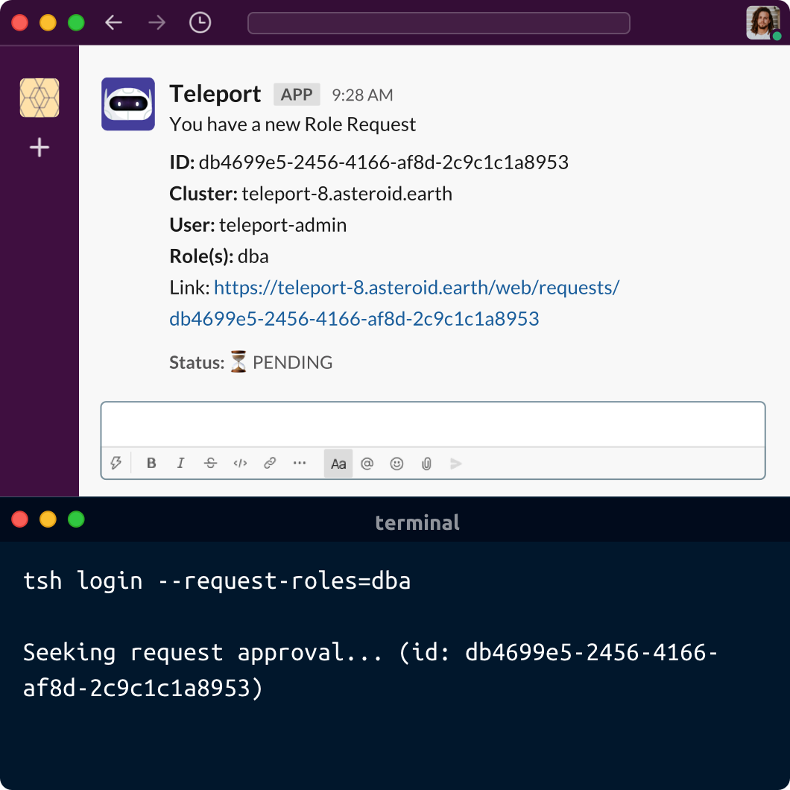

import {
  Box,
  Link,
  Section,
  SectionSteps,
  SectionTabs,
  SectionVisuals,
  Terminal,
} from "components";


<SectionTabs>
  <SectionTabs.Item
    src="./assets/move-away.svg"
    title="Move away from roots and admins"
    description="Access requests implement the principle of least privilege, which states that a client should be given only those privileges needed for it to complete the task at hand. This removes the need for super-privileged accounts."
  >
    <Terminal>
    ```bash
    $ tsh request create --roles=dba \
      --reviewers=alice@example.com,ivan@example.com --reason="ticket #123"

    # Alice
    $ tsh request list

    # Output
    ID                                   User             Roles   Created (UTC)       Status
    ------------------------------------ ---------------  ------- ------------------- -------
    9c721e54-b049-4ef8-a7f6-c777aa066764 bob@example.com  dba 03 Apr 21 03:58 UTC PENDING

    $ tsh request review --approve --reason="proceed with caution" 9c721e54-b049-4ef8-a7f6-c777aa066764
    ```
    </Terminal>
  </SectionTabs.Item>
  <SectionTabs.Item
    src="./assets/dual-auth.svg"
    title="Dual Authorization"
    description="Critical actions must be approved by multiple authorized team members as required by FedRamp AC-3. This prevents one successful phishing attack from compromising your system."
  >
    <Terminal>
    ```bash
    $ tsh request create --roles=dba \
      --reviewers=alice@example.com,ivan@example.com --reason="ticket #123"

    # Alice
    $ tsh request review --approve --reason="proceed with caution"

    # Ivan
    $ tsh request review --approve --reason="granted."
    ```
    </Terminal>
  </SectionTabs.Item>
  <SectionTabs.Item
    src="./assets/customize.svg"
    title="Customize to fit your needs"
    description="The Teleport API allows developers to define custom access workflows using a programming language they are familiar with. Teleport follows the “access as code” philosophy instead of “access as configuration”."
  >
    <Terminal>
    ```python
    # use your favorite programming language
    def process_request(req):
      #  grant admin only on registered computers
      if req.roles.contains("admin") and registered_computer(req.user):
          raise AccessDenied("use registered computer for privileged access")
      # contractors should provide a valid ticket
      if req.traits['team'] == "contractor" && not jira.get_ticket(req.note):
          raise AccessDenied("provide an active JIRA ticket")
    ```
    </Terminal>
  </SectionTabs.Item>
</SectionTabs>

<Section bg="gray">
  <SectionVisuals title="Access Requests using Existing Tools" description={<>
      <p>
        Approve access requests using the tools you already have, such as Slack, {' '}
        PagerDuty, and others. This allows security teams to approve or deny requests {' '}
        quickly and avoids frustration for engineers who need to get the job done.
      </p>
      <p>
        Approvals do not have to be done manually. Implement your own access approval {' '}
        logic with Teleport API using your favorite programming language.
      </p>
    </>}>
    <Box boxShadow="0 4px 32px rgba(0, 0, 0, 0.24)" borderRadius="md" lineHeight="0">
      
    </Box>
  </SectionVisuals>
</Section>

<Section bg="squares">
  <SectionSteps title="Access Requests Flow" description={<>To learn more about access requests, take a look at <Link href="/docs/" scheme="site">Teleport Documentation</Link> or read our <Link href="/features/access-requests/" scheme="site">blog</Link>.</>}>
    <SectionSteps.Item
      title="STEP 1"
      src="./assets/step-1.png"
      width={363}
      height={293}
    >
      Bob can create an access request for the `dbadmin` role in the Web
      UI or CLI.
    </SectionSteps.Item>
    <SectionSteps.Item
      title="STEP 2"
      src="./assets/step-2.png"
      width={457}
      height={228}
    >
      Chatbot will notify both Alice and Ivan.
    </SectionSteps.Item>
    <SectionSteps.Item
      title="STEP 3"
      src="./assets/step-3.png"
      width={363}
      height={293}
    >
      Alice and Ivan can review and approve request using Web UI or CLI.
    </SectionSteps.Item>
  </SectionSteps>
</Section>

