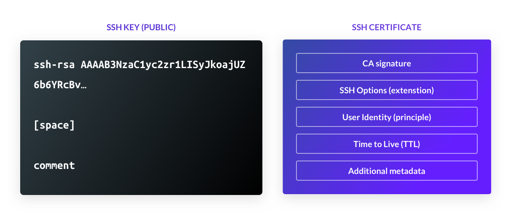

import NextImage from "next/image";
import { Flex, Figure, Sidebar, Feedback } from "components";

## The Basics

The SSH protocol offers authentication options: passwords, public keys, and certificates. The certificate-based authentication is the most secure of them all, but historically, it has been the most complicated to set up. One of our design goals for Teleport has been to make certificates easy.

First, let’s consider the differences between certificates and keys.

<Figure
  caption="Figure 1: Public SSH key and a Certificate"
  width={600} height={252}
  imagePositioning="left"
  xMargin={0}
>
    
</Figure>

As you can see, an SSH key is a binary proposition. Either you have it or you don’t, and a server will grant access to whomever happens to be in possession of the key, very similar to a physical door key. There is very little data about the owner of the key. Even the comment field is not mandatory and a client does not pass it to a server.

A certificate, on the other hand, contains much more data, and therefore:

- Certificates are tied to user identity.
- Certificates automatically expire.
- Certificates can contain SSH restrictions, e.g. forbidding PTY allocation or port forwarding.
- SSH certificates can be synchronized with Kubernetes certificates.
- Certificates include metadata. This enables role-based access control.
- Certificates solve TOFU (trust on first use) problems. In a Teleport cluster, all servers have identities and certificates of their own. They will not allow a connection if a client certificate is signed by an untrusted certificate authority.

Note that SSH certificates are not the same as the x509 certificates used by Kubernetes. Teleport Auth Service can issue both if support for Kubernetes is enabled.

## Authentication Flow

<Sidebar title="What is Login?" hiddenOnMobile={false}>
  When we talk about "logging into" a Teleport cluster, this means receiving a
  freshly issued certificate from a certificate authority (CA), such as from the
  Teleport Auth Service.
</Sidebar>

Teleport comes with its own `ssh` client - `tsh`. When a user types `ssh host` command,
Teleport will check if a user has a valid SSH certificate in the `~/.tsh` directory or loaded into an
`ssh-agent`. If no certificate is found, it will trigger the login sequence.

A user can force the login sequence by executing:

```bash
$ tsh login --proxy=teleport.example.com
```

&nbsp;  
This command takes the Teleport Proxy’s address as an argument.

The diagram below illustrates the login sequence. Teleport authentication uses SAML 2.0/OIDC Connect/OAuth2 family of protocols,
depending on the identity store. In this example the identity store is Github:

<NextImage
  src="../assets/teleport-proxy.png"
  alt="Teleport Proxy"
  height={348}
  width={600}
/>

1. The client requests a certificate via `tsh login`. This command launches a web browser on a client’s machine and directs it to a Teleport proxy.
2. The Teleport proxy redirects the user to Github’s login page, using Github’s 2FA.
3. Upon successful Github authentication, the browser is redirected back to the proxy, which forwards user identity to the Teleport auth service.
4. The auth service issues a certificate with a configured time to live (TTL) and it is returned to the client.

Upon successful authentication, an SSH certificate will be stored in the user's `~/.tsh/keys` directory and loaded into an `ssh-agent`, if there is one running. If Kubernetes support is enabled, an x509 certificate for Kubernetes will be stored there as well, and `~/.kube/config` will be updated with it.

The Teleport client stores the proxy service URL in `~/.tsh/profile`. The user does not need to use the `--proxy` flag again. They can edit the profile file when connecting to multiple Teleport clusters.

<Feedback reviews={meta.reviews} />

## Authentication for Services

<Sidebar title="What is tctl?" hiddenOnMobile={false}>
  `tctl` stands for Teleport Control and it is another command-line utility
  Teleport administrators use to manage a Teleport cluster.
</Sidebar>

SAML, OAuth2, and web browsers are great for interactive authentication for humans.

If authentication is needed for legacy automation similar to Jenkins, which relies on SSH credentials, a Teleport administrator can issue a certificate via:

```bash
  $ tctl auth sign -o jenkins.cert
```

&nbsp;  
It is recommended that such certificates be stored in secure storage.

## Connecting to Nodes

When a user is authenticated, they can establish SSH and Kubernetes connections to a cluster:

```bash
# using SSH
$ tsh ssh hostname

# using K8s
$ kubectl get pods
```

&nbsp;  
The Teleport client is called `tsh`, but you can rename it `ssh`, and this enables full command-line compatibility with OpenSSH client.

The diagram below shows how a connection is established:

{" "}

<NextImage
  src="../assets/teleport-connection.png"
  alt="SSH Key"
  height={300}
  width={600}
/>

- The client dials to the proxy service specified in `~/.tsh/profile` file and relays to it the hostname of the destination hostname.
- The proxy does not perform any decryption or authentication\*, it simply performs a name resolution for the given hostname and tries to relay the SSH connection to it. The user connection is shown in green.
- The destination host validates the user’s certificate and begins logging user actions to the auth service using its audit connection. The connection between a host and the auth service is also authenticated via the host’s certificate and encrypted. The audit connection is shown in red.
- If the destination host is a remote host, such as an IoT node (self-driving vehicle or a smart device) the connection is established using the reverse tunnel that remote nodes always maintain.

_\* By default, connections are encrypted end to end, but Teleport also supports the recording proxy legacy mode if the audit is required for legacy `sshd` daemons. In this mode, the proxy decrypts the connection and sends the audit information to the auth service._

## Logging Out

Unlike traditional OpenSSH-based workflows, Teleport allows users to log out. “Logging out” means erasing previously obtained certificates from a client machine.

```toml
$ tsh logout
```