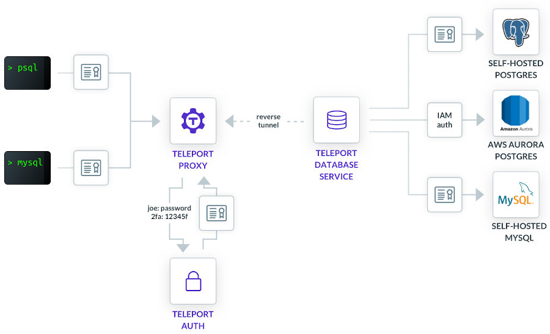

## Introduction

Teleport Database Access solves the problem of consolidated access to multiple
database instances running behind NAT across multiple cloud providers,
datacenters or even on edge networks. Teleport enforces the following access
best practices:

- Certificate-based authentication tied to user's identity. Certificates expire
  automatically and this removes the need for shared secrets, passwords, etc.
- There is a single sign-on process (SSO) which is tied to an organization's
  identity provider such as Google Apps, Active Directory, Okta, or any other
  IAM with SAML or OIDC support.
- Teleport keeps a detailed audit log of all database activity across all
  instances.

## Architecture

To better understand the concepts used in the diagram below, we recommend taking a
look at [Teleport Basic Concepts](../) first. The architecture diagram assumes that
database instances and clients can be located on different private networks,
and only _Teleport Proxy_ offers a publicly accessible endpoint:


<Figure
  caption="Figure 1: Database Access Architecture"
  width={700} height={424}
  imagePositioning="left"
  xMargin={0}
>
    
</Figure>


Deploying Teleport Database Access is simple because all Teleport components in
the diagram are implemented in a single dependency-free executable which can
run as a Linux daemon or in a Kubernetes pod.

- **Clients** on the left use `tsh` command to authenticate and receive
  short-lived certificates. `tsh` automatically configures `psql` and `mysql`
  commands, enabling smooth user experience.
- **Teleport Proxy** accepts client connections, forwards authentication requests
  to identity providers, serves a web UI for audit & administrative purposes.
  The proxy is publicly accessible, highly available and has a DNS address like
  `proxy.example.com`.
- **Teleport Auth** is a certificate authority (CA) which issues short-lived
  certificates to clients and also keeps the audit log of client sessions. The
  Auth Service must be deployed on a private network.
- **Teleport Database Service** is deployed on the same network as the target
  databases. It maintains a permanent encrypted reverse tunnel to the proxy.
  The tunnel is used to encapsulate the incoming client connections. The tunnel
  allows access to databases behind NAT without opening any network ports.

## Establishing Connections

Let's consider what happens when a client needs to connect to a database.

1. The client issues `tsh login --proxy=proxy.example.com` command. This command
   triggers the single sign-in (SSO) sequence with an identity provider
   (Teleport offers a built-in database of users too). After a successful
   authentication, `tsh` receives a short-lived x.509 certificate and stores it
   on a client side, usually in `~/.tsh` directory.
2. The client must select a database it wants to connect to via `tsh db login`.
   This command will configure the database client such as `mysql` or `psql`
   with a Teleport proxy address and the selected database. The list of
   available databases can be printed with `tsh db ls` command.
3. The client uses `psql` or `mysql` as usual, to connect to the selected database.
4. The proxy accepts the connection, and dispatches it to the appropriate
   database service based on the routing information encoded in the client
   certificate, over the reverse tunnel.
5. The database service authenticates the connection, performs an authorization
   check, and then establishes the connection to the database.
6. The Database Service begins proxying traffic between the user's database
   client and the database. Additionally, it interprets the database wire
   protocol messages and submits events to the Teleport audit log.

## Audit Log

The audit information is collected by the _Teleport Auth Service_. Teleport
logs the following information:

- Access events such as authentication attempts, connected/disconnected
  sessions, and so on.
- SQL queries executed by clients.

The location of the audit log is configurable. The following locations are
supported:

- Local storage, i.e. on any Linux file systems.
- Cloud storage such as DynamoDB, Google Firebase and others.
- AWS S3.

Teleport relies on the storage back-ends to provide the encryption at rest
capabilities. Teleport uses a documented JSON format for the audit log events,
making it easy to export audit log events into external SIEM tools or general
purpose solutions such as Splunk or Elastic.

Example of a JSON event recorded in Teleport Audit Log:

```toml
{
  "cluster_name": "staging",
  "code": "TDB02I",
  "db_name": "test",
  "db_protocol": "postgres",
  "db_query": "SELECT * FROM test;",
  "db_service": "db2",
  "db_uri": "db2:5432",
  "db_user": "postgres",
  "ei": 1,
  "event": "db.session.query",
  "sid": "c31c3969-39fc-4ce4-8cd6-683fa188e001",
  "time": "2021-03-11T21:42:38.485Z",
  "uid": "922e023c-b8b5-41cc-993e-e600a5387ef6",
  "user": "r0mant"
}
```

&nbsp;  
To learn more about Database Access, take a look at [Teleport Documentation](/teleport/docs/database-access/getting-started/).