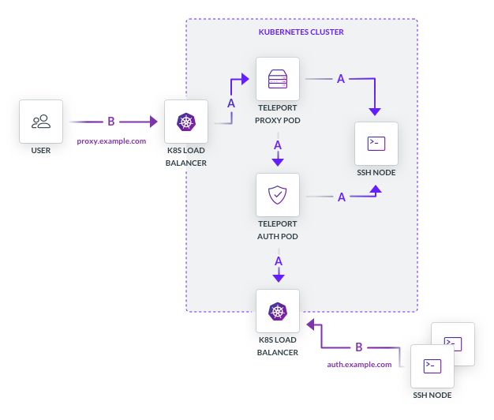

## Introduction

Most organizations' environments are complex. They include Kubernetes clusters
as well as standalone virtual cloud instances, or even bare-metal servers that
need SSH access. Often, infrastructure is scattered around multiple data
centers and cloud providers. Teleport can provide a simple, unified way to
access all environments via a single access point, using the same identity
provider. This allows for having the same role-based access (RBAC) rules for
both, Kubernetes and SSH access. It also makes user experience better.

## User Experience

On the client, users must authenticate using the `tsh` command-line
utility, which opens the web browser if SSO authentication is configured. Upon
successful authentication, `tsh` automatically updates
`~/.kube/config` file for all Kubernetes tools:

```toml
# login:
$ tsh login --proxy=proxy.example.com

# access Kubernetes cluster API:
$ kubectl get pods

# or SSH into a node:
$ ssh node
```

The access will be automatically revoked when the Teleport-issued certificate's
time to live (TTL) expires. Users may also explicitly log out if using someone
else's untrusted computer:

```toml
$ tsh logout
```

## Using Multiple Clusters

If Teleport is configured with multiple Kubernetes clusters, users may
choose which one to connect to by executing `tsh login <cluster-name>`. 
If a user already has a valid certificate, this command does not trigger 
the SSO login prompt. It only updates `~/.kube/config` with the selected 
cluster.

```toml
# print the list of trusted clusters:
$ tsh clusters
staging
production

# select the staging cluster, this command updates ./kube/config:
$ tsh login staging

# talk to Kubernetes API:
$ kubectl get pods
```

## How does it work?

_This section assumes that you are already familiar with basic Teleport architecture and understand the 
concept of a [Teleport Cluster](../)_
    
Let's consider a simple environment on a private network with a single
Kubernetes cluster. To enable access to this cluster from a public network via
Teleport:

* The Kubernetes integration must be enabled in the Teleport proxy service configuration file.
* The Teleport Proxy service should be given Kubernetes API access with permissions to use 
  the [user impersonation](https://kubernetes.io/docs/reference/access-authn-authz/authentication/#user-impersonation).
  The easiest way to do this is to deploy the Proxy Service into a Kubernetes
  cluster and give its service account the right permissions.

The location of the Teleport auth service does not matter as long as the Proxy
Service can connect to it. If SSH connectivity is required, any SSH node can be
accessed via Teleport regardless of whether it is a part of Kubernetes or not,
as long as:

* The Teleport proxy service can connect to a node.
* A node can connect to the Teleport auth service.

The diagram below illustrates the typical Teleport deployment into a Kubernetes cluster.

<Figure
  caption="Figure 1: Single-cluster Kubernetes Integration"
  width={626} height={532}
  imagePositioning="left"
  xMargin={0}
>
    
</Figure>


In the example above:

1. Teleport Proxy and Teleport Auth services are both deployed into the Kubernetes cluster as pods.
2. Connections over the internal Kubernetes cluster network are marked as <span style={{color: "blue"}}>"A"</span> 
   and connections from outside the Kubernetes network are marked as <span style={{color: "purple"}}>"B"</span>.
3. Teleport Proxy is exposed to the outside world via a Kubernetes service of
   the Load Balancer type. It has a fully qualified domain name with proper
   HTTP/TLS encryption, in this example it is `https://proxy.example.com`
4. Teleport Auth Service is exposed to the internal network (but external to
   Kubernetes), i.e. a VPC on AWS or VLAN in a traditional data center, the
   same network on which non-Kubernetes SSH nodes are running.

The Teleport Auth service maintains a list of Teleport roles. Each Teleport
role is mapped to a set of Kubernetes groups and they, in turn, are mapped to
an identity provider such as Okta or Active Directory. This is how
synchronization of permissions works across SSH and Kubernetes.

## How do multiple Kubernetes clusters work?

As you can see, each Kubernetes cluster becomes a Teleport cluster if Teleport
is deployed inside of one.  Teleport has the ability to connect multiple
clusters together. For example, you have multiple Kubernetes clusters set up
similarly to the diagram above, you can configure Teleport to proxy users
between multiple clusters.

This capability is called "Trusted Clusters" or "Remote Clusters" and you can read 
more about it in the [SSH and Kubernetes on the Edge](../ssh-kubernetes-access-on-the-edge) page.
