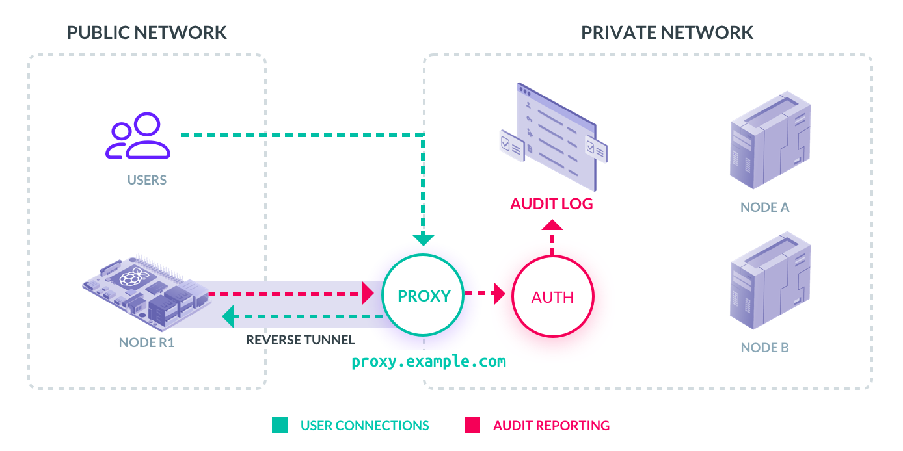
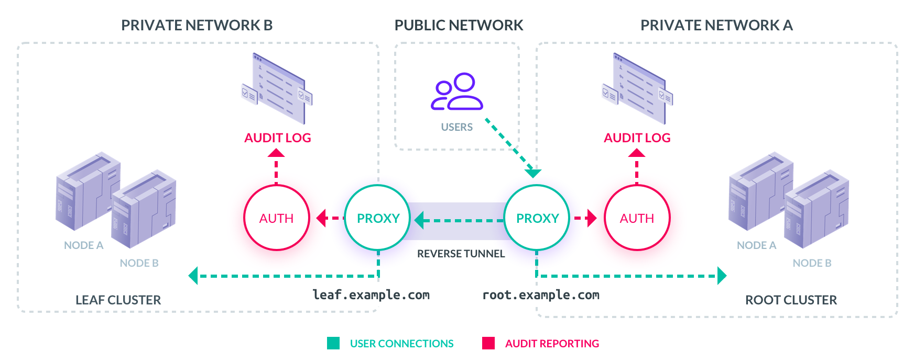
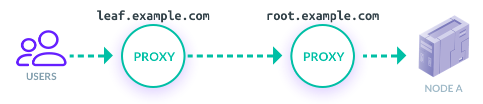

import Admonition from "components/Admonition";
import Sidebar from "components/Sidebar";

## Introduction

Suppose you manufacture small ARM-powered devices like network equipment or self-driving vehicles. Perhaps you deploy small server clusters on the edge. These devices will connect to the internet via an unreliable cellular network or a private network behind NAT. In this case, Teleport allows you to do the following:

- Connect to remote devices via SSH as if they were located in your own cloud.
- Connect to remote Kubernetes clusters as if they were located in your own cloud.
- Connect to web applications running on remote devices using a web browser via HTTPS.

This approach is superior to distributed VPN technology because Teleport is application-aware. Enforcing security on a higher level of the OSI model adheres to the principles of Zero Trust, where networks, including VPNs, are considered inherently untrustworthy. Being application-aware allows Teleport to provide more flexibility for configuring role-based access control and implement rich audit logging.

## Edge Access Basics

The underlying technology behind this is reverse tunnels. A reverse tunnel is a secure connection established by an edge site into a Teleport cluster via the cluster's proxy.

There are two types of reverse tunnels:

- A reverse tunnel between a remote node and a Teleport cluster.
- A reverse tunnel between **two Teleport clusters**. Such clusters are called Trusted Clusters.

Let’s look into each type in more detail.

## Connecting Remote nodes

The diagram below shows the Teleport cluster accessible via a proxy on `proxy.example.com`. This cluster has two regular nodes (A and B) and one remote node (R1).

<Figure
  caption="Figure 1: Remote Nodes"
  width={700} height={350}
  imagePositioning="left"
  xMargin={0}
>
    
</Figure>

From a user's perspective, there is no difference between the nodes on
the private network and the remote box `node-R1`. A user may have an Ansible
script which pushes a code update simultaneously into all nodes, i.e. `node-A`,
`node-B` and `node-R1`:

```toml
# login into the cluster:
$ tsh login --proxy=proxy.example.com

# SSH into node running on VPC/LAN:
$ ssh node-a

# SSH into a remote note:
$ ssh node-r1
```

## How does it work?

The `teleport` daemon on regular nodes A and B is usually configured as a systemd unit and takes the following command-line arguments:

```toml
# local nodes need to know the address of the auth service on the private network
$ teleport start --auth=auth.example.com
```

&nbsp;  
But the `teleport` daemon on the remote device does not have access to `auth.example.com`, because
it resolves to a local IP on the private network. The remote nodes must use the address of a proxy instead:

```toml
# remote nodes use the proxy address instead of the auth service:
$ teleport start --auth=proxy.example.com
```

<Sidebar title="Audit Logging" hiddenOnMobile={false}>
  Remote nodes report audit information such as session recordings and security
  events related to user activity from the cluster using the same reverse
  tunnel.
</Sidebar>

Using the proxy service address instead of the auth service address instructs
the proxy daemon to create a permanent reverse tunnel, through which future user
connections will be proxied.

Why not connect all nodes as remote, then? You can, but reverse tunnels require more system resources, so using the auth service address is more optimal, as it reduces the load on the proxy.

## Connecting Remote Clusters

It is also possible to create reverse tunnels between two Teleport clusters. This may be useful in the following scenarios:

- Establishing seamless **access across many cloud environments** or data centers via a single gateway (Teleport Proxy). This use case is popular with large scale SaaS vendors.
- Establishing seamless **access across many edge environments**, where each environment consists of multiple nodes. This use case is common in the energy, retail, and transportation sectors.
- Establishing secure **access to cloud environments owned by other organizations**. This use case is popular with managed service providers who manage cloud infrastructure and cloud applications for their clients.

<Admonition type="note" title="IMPORTANT" bg="#E0F2FC">
  It is possible to connect an arbitrary number of Teleport clusters together.
  To address individual clusters, administrators must assign a unique name to
  each cluster.
</Admonition>

To understand how this works, consider the diagram below, which shows two Teleport clusters:

- On the right, we have the **ROOT** cluster. Its proxy service is accessible via `root.example.com` and it has two nodes named A and B.
- On the left, we have the **LEAF** cluster. Its proxy service is accessible via `leaf.example.com` and it also has two nodes, also named A and B.

<Figure
  caption="Figure 2: Trusted Clusters"
  height={350}
  width={870}
  imagePositioning="left"
  xMargin={0}
>

</Figure>

### How do we give users access to both clusters?

One approach is to configure both clusters with the same identity storage, possibly Github or Google Apps. A user will have to log in via two different proxies: `leaf.example.com` and `root.example.com`.

### This will work unless one of the following is true:

- `leaf.example.com` may be behind NAT and inaccessible to external users.
- There could be too many leaf clusters, making manual switching cumbersome.
- The LEAF and the ROOT clusters can be managed by different organizations, making it impossible to use the same identity store.

Another approach is to let users go through `root.example.com` and configure the ROOT cluster to proxy their connections into the LEAF cluster. This capability is called Trusted Clusters in Teleport documentation.

By creating a reverse tunnel from the LEAF to the ROOT, the ROOT cluster becomes “trusted,” because its users\* are now allowed to access the LEAF. The connection from a user to the A node inside the LEAF will look like this:

<Figure
  caption="*Disclaimer: Role-based access control can be used only to allow certain user
  groups to jump across clusters."
height={110} width={500}  imagePositioning="left"
  xMargin={0}
>

</Figure>

## User Experience

In the scenario above with two trusted clusters, here is how a user session may look:

```toml
# login into the ROOT cluster:
$ tsh login --proxy=root.example.com

# SSH into node A of the ROOT cluster
$ ssh node-a

# SSH into node A of the LEAF cluster:
$ ssh --cluster=leaf node-a
```

## Audit Logging

Note that the audit records never leave cluster boundaries. When users connect to LEAF nodes via the ROOT cluster, their actions will be recorded in the audit log of the LEAF cluster.
