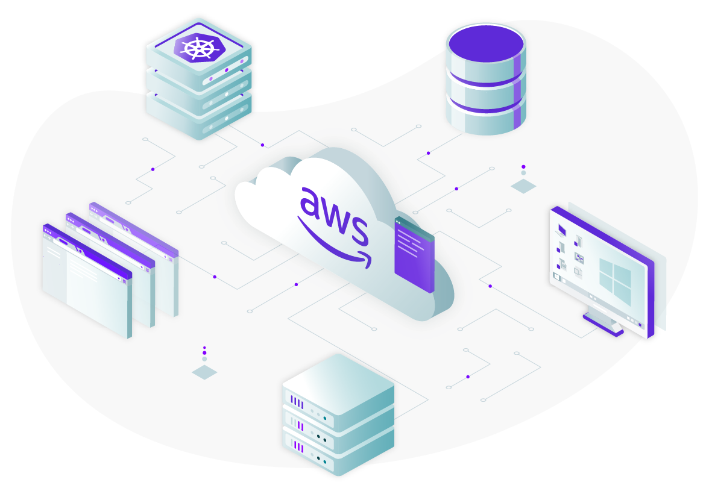

import AnnouncementBar from "components/AnnouncementBar";
import CenterCard from "components/CenterCard";
import EasyStart from "components/EasyStart";
import Feedback from "components/Feedback";
import Image from "components/Image";
import Link from "components/Link";
import NewsItem from "components/NewsItem";
import ProductBanner from "components/ProductBanner";
import Section from "components/Section";
import SectionHeader from "components/SectionHeader";
import Terminal from "components/Terminal";
import TryTeleport from "components/TryTeleport";
import WorksWith from "components/WorksWith";
import { SaaS } from "components/AnnouncementBar/data";
import secteams from "./assets/for-secteams.svg";
import startups from "./assets/for-startups.svg";
import largorgs from "./assets/for-largorgs.svg";

<Section bg="flatGray">
  <SectionHeader
    bg="transparent"
    title={meta.title}
    subtitle={meta.subtitle}
    description={meta.headerDescription}
    width="100%"
    mode="none"
  >
    
  </SectionHeader>
  <NewsItem display="flex" flexDirection="row" alignItems="center">
    Teleport is available in the
    <Link href="https://aws.amazon.com/marketplace/pp/prodview-syjxiiw25cr3u?sr=0-1&ref_=beagle&applicationId=AWSMPContessa">
      <Image ml="10px" src="./assets/aws-marketplace-logo.svg" />
    </Link>
  </NewsItem>
  <AnnouncementBar type="big" rows={SaaS} />
</Section>

<Section width="100%" bg="flatWhite">
  <ProductBanner
    title="Unique challenges faced by AWS customers"
    width="100%"
    src="./assets/unique-challenges@2x.png"
    imgPosition="right"
    description={
      <>
Managing identity-based access to AWS resources across multiple accounts is time-consuming and complex 
but necessary to control costs, as well as ensure security and compliance.
      </>
    }
>
    <ProductBanner.Item  title="Infrastructure sprawl"  badgeName="server">
      You need to control who can provision infrastructure to control costs and prevent sprawl.
    </ProductBanner.Item>
    <ProductBanner.Item  title="Granular access" badgeName="layers">
      Different teams require different levels of identity-based access for different resources.
    </ProductBanner.Item>
    <ProductBanner.Item  title="Security &amp; Compliance" badgeName="quickstart">
      You need to lock down who can provision & access your AWS infrastructure and keep detailed audit logs. 
    </ProductBanner.Item>
  </ProductBanner>
</Section>

<CenterCard 
  name="shieldCheck" 
  title="Why AWS customers big and small trust Teleport" 
  text="Our unique approach to AWS infrastructure access is not only more secure &mdash; it actually improves developer productivity.  By providing an identity-aware AWS infrastructure access solution that developers love to use, you can easily implement security and compliance without worrying about backdoors that outmoded solutions encourage."/>

<Section>
  <Feedback reviews={meta.reviews} />
</Section>

<Section width="100%" bg="flatWhite">
  <ProductBanner
    subtitle="Get the most out of AWS Management Console"
    title="Control who can provision AWS resources"
    width="100%"
    src="./assets/management-console@2x.png"
    imgPosition="right"
    logoSrc={startups}
    description={
      <>
        With Teleport, you can separate who can provision AWS resources from who can access them.
        We provide an identity-aware access solution for the AWS Management Console and CLI that enables fine-grained, role-based access controls to prevent unauthorized creation of AWS resources.  If an SRE needs to be able to provision new AWS resources, you can easily grant temporary elevated access that automatically expires.
      </>
    }
  >
    <ProductBanner.Item title="AWS Management Console" src="./assets/aws-management-console-icon.svg" size="lg" shadow>
      Teleport provides connectivity, authentication, authorization and audit for AWS Management Console & CLI.
    </ProductBanner.Item>
    <ProductBanner.Item title="AWS CLI" src="./assets/aws-cli-icon.svg" size="lg" shadow>
      Enforce the same controls for AWS Console at the AWS CLI level.
    </ProductBanner.Item>
    <ProductBanner.Item title="Complete audit in AWS CloudTrail" src="./assets/aws-cloudtrail-icon.svg" size="lg" shadow>
      Teleport ensures all AWS Console activity is logged in CloudTrail for complete visibility into access & behavior.
    </ProductBanner.Item>
  </ProductBanner>
</Section>

<Section width="100%" bg="flatGray">
  <ProductBanner
    subtitle="Deep integration for AWS products"
    title="Easily enforce granular controls for AWS resources"
    width="100%"
    src="./assets/deep-integration@2x.png"
    imgPosition="left"
    logoSrc={largorgs}
    description={
      <>
        Teleport enables you to provide fine-grained, identity-based access to your critical AWS resources like Linux & Windows EC2 instances, RDS, Redshift and Aurora databases, EKS clusters, even CI/CD systems like Jenkins and dashboards like Grafana and Kibana running on AWS.
      </>
    }
  >
    <ProductBanner.Item title="AWS EC2" src="./assets/aws-ec2-icon.svg" size="lg" shadow>
      Integrate and extend your corporate identity roles with Teleport access for EC2. New EC2 instances automatically join your Teleport cluster. Supports Linux & Windows.
    </ProductBanner.Item>
    <ProductBanner.Item title="AWS RDS, Redshift & Aurora" src="./assets/aws-aurora-icon.svg" size="lg" shadow>
      Get table-level controls for your databases running on AWS and complete visibility to the queries your team are running.
    </ProductBanner.Item>
    <ProductBanner.Item title="AWS EKS" src="./assets/aws-eks-icon.svg" size="lg" shadow>
      Specify separate permissions for Kubernetes pods running on EKS than the underlying EC2 instance.
    </ProductBanner.Item>
  </ProductBanner>
</Section>

<Section width="100%" bg="flatWhite">
  <ProductBanner
    subtitle="Built to make the most out of AWS"
    title="Teleport uses AWS services for the most integrated experience"
    width="100%"
    src="./assets/build-to-make@2x.png"
    imgPosition="right"
    logoSrc={secteams}
    description={
      <>
       The Teleport Cloud runs on AWS, so whether you use our hosted control plane, or self-host on AWS, you get the same integrated experience.
      </>
    }
  >
    <ProductBanner.Item title="Hosted on AWS" src="./assets/aws-icon.svg" size="lg" shadow>
      The Teleport Cloud is hosted across multiple AWS regions so you can run your AWS workloads close to your Access Plane.
    </ProductBanner.Item>
    <ProductBanner.Item title="Buy on AWS Marketplace" src="./assets/aws-marketplace-icon.svg" size="lg" shadow>
      Purchase Teleport directly via the AWS Marketplace or use AWS credits to pay for Teleport usage.  Private offers available for enterprise customers.
    </ProductBanner.Item>
    <ProductBanner.Item title="AWS CloudHSM" src="./assets/aws-cloudhsm-icon.svg" size="lg" shadow>
    For added security protecting the Teleport Certificate Authority (CA) running on AWS, we support AWS CloudHSM.
    </ProductBanner.Item>
  </ProductBanner>
</Section>

<Section bg="flatWhite">
  <WorksWith title="Works with everything you have" AWS>
    Teleport is open source and it relies on open standards such
    as X.509 certificates, HTTPS, SAML, OpenID connect and others. Deployed as a
    single-binary, it seamlessly integrates with the rest of your AWS stack.
  </WorksWith>
</Section>

<EasyStart
  description="Teleport is easy to deploy and use. We believe that simplicity and good user experience are key to first-class security."
  listDescription="Teleport consists of just two binaries."
  listItems={[
    <>The <span style={{color: "#512FC9", fontFamily: "Ubuntu Mono"}}>tsh</span> client allows users to login to retrieve short-lived certificates.</>, 
    <>The <span style={{color: "#512FC9", fontFamily: "Ubuntu Mono"}}>teleport</span> agent can be installed on any server or any Kubernetes cluster with a single command.</>
  ]}
>
  <Terminal>
```
# on a client
$ tsh login --proxy=example.com

# on AWS Linux 2
$ yum install teleport

# in a Kubernetes cluster
$ helm install
```
  </Terminal>
</EasyStart>

<TryTeleport />