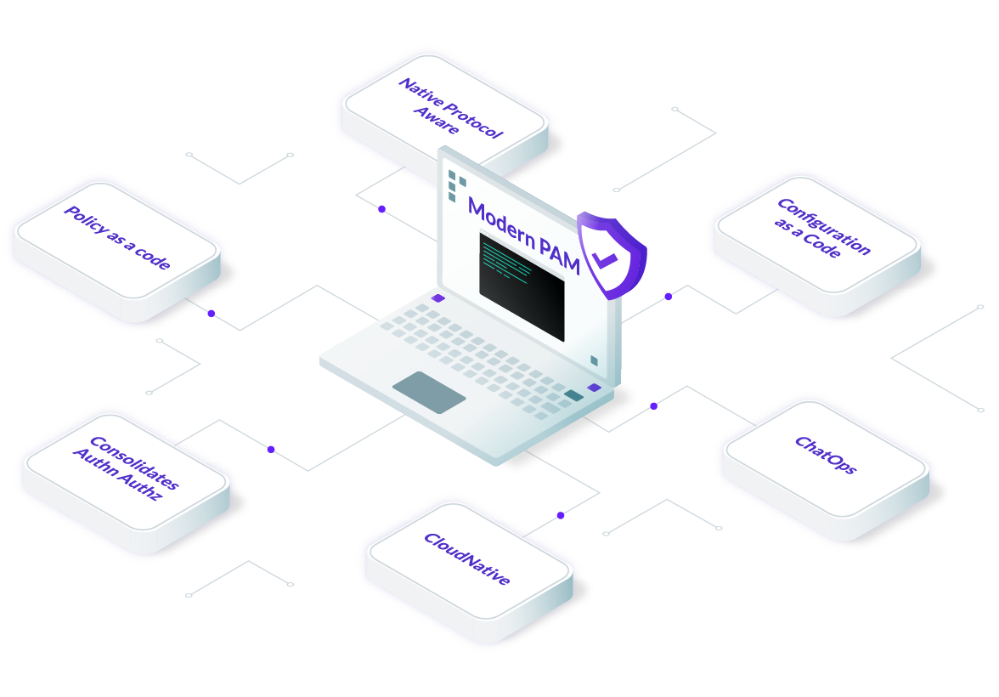

import AnnouncementBar from "components/AnnouncementBar";
import { ModernizePam } from "components/AnnouncementBar/data";
import CenterCard from "components/CenterCard";
import Feedback from "components/Feedback";
import PDFTeaser from "components/PDFTeaser";
import ProductBanner from "components/ProductBanner";
import Section from "components/Section";
import SectionHeader from "components/SectionHeader";
import EasyStart from "components/EasyStart";
import Terminal from "components/Terminal";
import TryTeleport from "components/TryTeleport";

<Section bg="flatGray">
  <SectionHeader
    bg="transparent"
    subtitle="Privileged Access Management"
    title="Modernize your PAM"
    description="Teleport is a modern PAM that secures your critical infrastructure without slowing developers down."
    link={{ href: "/pricing/", text: "Get Started", shape: "lg" }}
  >
    
  </SectionHeader>
  <AnnouncementBar type="big" rows={ModernizePam} />
</Section>

<Section width="100%" bg="flatWhite">
  <ProductBanner
    title="Challenges with traditional PAM solutions"
    src="./assets/challenges-with-traditional-pam@2x.png"
    imgPosition="right"
    description={
      <>
        Protecting critical infrastructure requires a well-thought out PAM
        strategy. However, traditional Privileged Access Management solutions
        have not kept up with modern developer practices. Traditional PAM slows
        developers down by constantly sending them to a centralized vault to
        checkout credentials, and encourages insecure workarounds that leave you
        exposed to security threats and compliance violations.
      </>
    }
  >
    <ProductBanner.Item
      title="Developer workflows"
      badgeName="developerWorkflow"
    >
      Forcing developers to check out keys before gaining access to do their
      jobs wreaks havoc on productivity.
    </ProductBanner.Item>
    <ProductBanner.Item title="Cloud-native support" badgeName="cloud">
      Traditional PAM solutions struggle to support cloud-native applications
      and automation that modern DevOps teams need.
    </ProductBanner.Item>
    <ProductBanner.Item title="Complexity" badgeName="layers">
      Traditional PAM solutions are expensive to buy and complex to operate.
    </ProductBanner.Item>
  </ProductBanner>
</Section>

<CenterCard
  name="shieldCheck"
  title="Teleport is a modern PAM solution loved by Developers & Security Professionals"
  text="Our unique approach to Privileged Access Management is not only secure — it actually improves developer productivity. By providing an identity-aware infrastructure access solution that developers love to use, you can easily implement security and compliance without worrying about backdoors that outmoded solutions encourage."
/>

<Section>
  <Feedback reviews={meta.reviews} />
</Section>

<Section width="100%" bg="flatGray">
  <ProductBanner
    subtitle="For Security Teams"
    title="Everything you need in a PAM"
    src="./assets/recorded-session-gif@2x.gif"
    imgPosition="right"
    label={
      <>
        All sessions are recorded and can be played back at anytime.
      </>
    }
    addImageMargin
    description={
      <>
        Teleport delivers essential PAM capabilities such as zero standing
        privileges, just-in-time (JIT) access and activity logging so that you
        can protect your critical infrastructure. With Teleport, you can easily
        enforce MFA, RBAC, and SSO using identity-based, short-lived
        certificates.
      </>
    }
  >
    <ProductBanner.Item title="Zero-standing privileges">
      Teleport enables you to implement zero standing privileges for all your
      infrastructure resources including Linux & Windows servers, Kubernetes
      clusters, databases and internal applications.
    </ProductBanner.Item>
    <ProductBanner.Item title="Just-in-time access">
      Approve or deny privilege escalation requests using flexible access
      requests. Approve or deny access via ChatOps, Slack, PagerDuty, or access
      approval can be customized via the programmable API.
    </ProductBanner.Item>
    <ProductBanner.Item title="Session logging & recordings">
      Observe every online resource, every connection, every interactive
      session, in real time. Teleport records all events into a structured audit
      log or recording, making it easy to see what’s happening and who is
      responsible.
    </ProductBanner.Item>
  </ProductBanner>
</Section>

<Section width="100%" bg="flatWhite">
  <ProductBanner
    subtitle="For Developers"
    title="A PAM that improves developer productivity"
    src="./assets/developer-productivity@2x.png"
    imgPosition="left"
    border="1px solid black"
    description={
      <>
        Teleport was built to maximize developer productivity. Instead of
        constantly checking out credentials from a centralized vault, Teleport
        enables identity-based, passwordless access to infrastructure resources
        directly.
      </>
    }
  >
    <ProductBanner.Item title="Seamless access">
      Because Teleport uses short-lived certificates instead of shared
      credentials, developers just need to authenticate via SSO one time to
      access any infrastructure resource.
    </ProductBanner.Item>
    <ProductBanner.Item title="ChatOps">
      Engineering teams can easily manage privilege escalation requests via the
      tools they already use like Slack and JIRA.
    </ProductBanner.Item>
    <ProductBanner.Item title="Works with dev tools">
      Teleport enables developers to use the tools they love like OpenSSH and
      native database clients instead of subpar tooling that ships with the PAM.
    </ProductBanner.Item>
  </ProductBanner>
</Section>

<Section width="100%" bg="flatGray">
  <ProductBanner
    subtitle="For Operations"
    title="Run your PAM just like any other app"
    src="./assets/pam-like-other-app@2x.png"
    imgPosition="right"
    description={
      <>
        Traditional PAM solutions are a beast to operate. Not Teleport.
        Deploying and managing Teleport is as easy as operating any other
        cloud-native application. Or use Teleport Cloud and we’ll operate it for
        you.
      </>
    }
  >
    <ProductBanner.Item title="Deploy as a container">
      You can deploy and run Teleport as a container and leverage your automated
      CI/CD pipelines or Kubernetes to manage it.
    </ProductBanner.Item>
    <ProductBanner.Item title="Dynamic resources">
      Teleport intelligently identifies when additional protected resources come
      online without manual registration.
    </ProductBanner.Item>
    <ProductBanner.Item title="Teleport Cloud">
      You can use Teleport Cloud to access any privileged resources no matter
      where they run.
    </ProductBanner.Item>
  </ProductBanner>
</Section>

<PDFTeaser
  title="451research: Teleport ‘shifts left’ with cloud-native PAM platform"
  src="./assets/cover-photo@2x.png"
  pdfSource="https://goteleport.com/static/resources/analyst-reports/451_Reprint_Teleport_28JAN2022.pdf"
  alt="451Reaseach PDF"
>
  ‘Shifting left’ has become a thing in security circles, and addressing the
  needs of developers is no less true in the privileged access management
  market. Teleport’s Access Plane combines connectivity, authentication,
  authorization and auditing functionality into a single PAM platform that could
  rightly be viewed as ‘Okta for infrastructure.'
</PDFTeaser>

<PDFTeaser
  bg="grayWave"
  title="Buyer’s Guide for Modern PAM"
  src="./assets/modern-PAM-buyers-guide-cover@2x.png"
  pdfSource="https://goteleport.com/resources/white-papers/pam-buyers-guide/"
  alt="Privileged Access Management PDF"
>
  This guide walks you through the essential capabilities that any Privileged
  Access Management solution must have to support cloud-native workloads. The
  guide breaks your buying decision down into three sections: Features, Ease of
  Use, and Maintainability.
</PDFTeaser>

<EasyStart
  description="Teleport is easy to deploy and use. We believe that simplicity and good user experience are key to first-class security."
  listDescription="Teleport consists of just two binaries."
  listItems={[
    <>The <span style={{color: "#512FC9", fontFamily: "Ubuntu Mono"}}>tsh</span> client allows users to login to retrieve short-lived certificates.</>,
    <>The <span style={{color: "#512FC9", fontFamily: "Ubuntu Mono"}}>teleport</span> agent can be installed on any server or any Kubernetes cluster with a single command.</>
  ]}
>
  <Terminal>
  ```
  # on a client
  $ tsh login --proxy=example.com

  # on a server
  $ apt install teleport

  # in a Kubernetes cluster
  $ helm install
  ```
  </Terminal>
</EasyStart>

<TryTeleport/>
