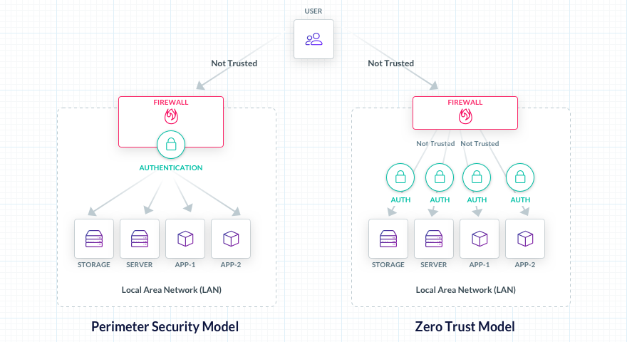

import {
  AnnouncementBar,
  Centrator,
  PageIntro,
  Section,
  TryTeleport,
} from "components";
import {
  CompactClients1,
  CompactClients2,
  CompactClients3,
} from "components/AnnouncementBar/data";

<Section bg="grayWave" borderBottom="light-gray">
  <Centrator py={3}>
    <PageIntro
      title="What is Zero Trust"
      subtitle="Teleport Access Plane"
      description="Zero Trust is an approach to security design for information systems where access to a resource is granted based solely on the identity and intent of a user, as opposed to the user’s physical, or on a network location."
      width="100%"
      verticalResponsive={false}
      renderSmallHeading={true}
    />
  </Centrator>
</Section>

<Centrator maxWidth="960px">
<Section bg="flatWhite" lineHeight="lg">

## Quick Answer:

Zero Trust is an approach to security design for information systems where access to a resource is granted based solely on the identity and intent of a user, as opposed to the user’s physical, or on a network location.

The Zero Trust approach supersedes perimeter-based security, where users “inside the perimeter” i.e. on a trusted LAN were automatically given elevated permissions.

Ultimately, the Zero Trust approach makes technologies such as firewalls and VPNs obsolete, as it calls for every resource to be protected as if it has a publicly reachable IP address. For example, this could include a resource hosted on the Internet.

The difference between Zero Trust design and the traditional approach based on firewalls and VPNs can be seen in the following illustration:

<Figure align="center">
  
</Figure>
## History of Zero Trust

In the early days of computer networking, cybersecurity was not even a word. The only security measure in place was physical security to
protect equipment in computer rooms. The predecessor to the Internet, ARPANET was
a community of researchers, universities, and government agencies who trusted each
other.

As more users joined the network, the concept of network security started to evolve and the Digital Equipment Corp published details of the first packet-switching firewall in 1988. Local Area Networks (LANs) connected a limited area of devices, campuses or offices, whereas Wide Area Networks (WANs) spread over large geographic regions. Firewalls were invented to separate the two.

Thus, a Local Area Network (LAN) was considered a safe place where all users on the local network were trusted, as opposed to WAN users. The concept of perimeter security became the standard approach to cybersecurity.

Organizations had adopted sophisticated solutions to enforce policies on who and what entered through firewalls. But by the 90s, the definition of a perimeter had expanded dramatically. In addition to office workstations, employees adopted mobile devices and started working from home.

Amazon broke cloud computing ground with AWS, extending the perimeter from an organization’s data center into the cloud. Solutions emerged in the form of VPNs, but this only added more bloat and complexity to network security, while making the user experience worse.

Members of the 2004 Jericho Forum concluded that perimeter security was no longer working and despite industry efforts, the boundary between WANs and LANs had been deteriorating. Six years later, the analyst at Forrester Research named John Kindervag came up with the term, “Zero Trust”.

The basic principle of Zero Trust is that a network, private or public, is never secure, period.

It fundamentally removes the concept of a perimeter. A Zero Trust system does not differentiate based on where you are. It only cares about who you are. Every resource in a Zero Trust environment must authenticate its users. More information on how to implement Zero Trust security in your organization can be found in the related articles below.

## Conclusion

Zero Trust elevates security concerns from the lower layers of the OSI model to the session or application layers. Here, every client must authenticate to access every resource. Zero Trust principles teach to never trust clients based on their network credentials. That is why VPNs and firewalls are considered obsolete in this model: users who have successfully authenticated with a VPN or are allowed through a firewall are considered to be untrustworthy as users outside of a company network.

## Related Articles

- [Applying the Principles of Zero Trust to SSH](https://goteleport.com/blog/applying-principles-of-zero-trust-to-ssh/)
- [From Zero to Zero Trust](https://goteleport.com/blog/zero-to-zero-trust/)
- [VPNs and Zero Trust: Thoughts on the Evolving Nature of Remote Access](https://goteleport.com/blog/vpns-and-zero-trust-thoughts-on-the-evolving-nature-of-remote-access/)

</Section>
</Centrator>

<Section bg="flatWhite" px={10} py={10}>
  <AnnouncementBar
    caseStudy
    title
    rows={[CompactClients1, CompactClients2, CompactClients3]}
  />
</Section>
<TryTeleport />
